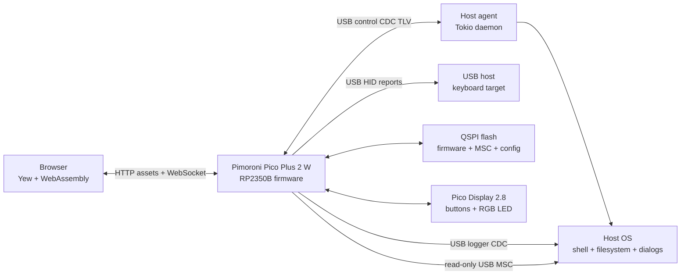
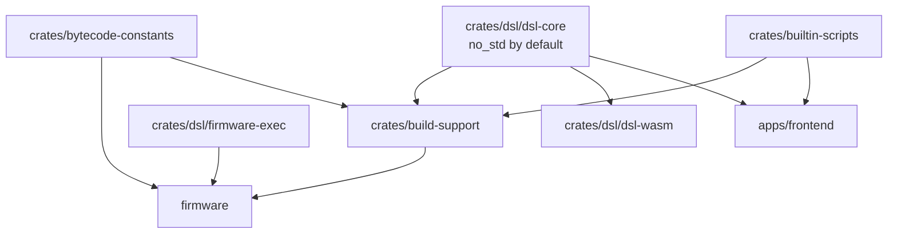
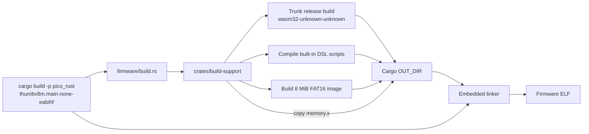
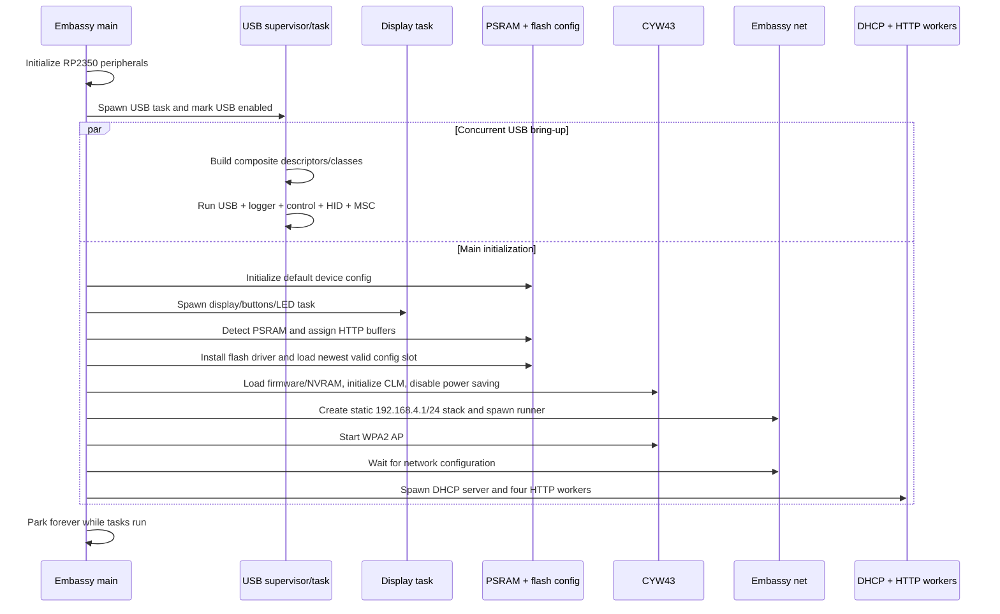
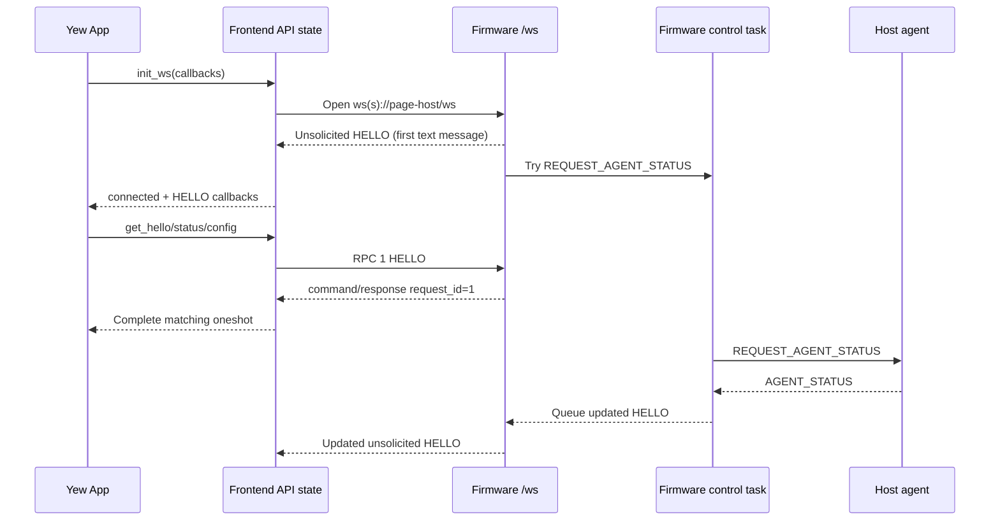
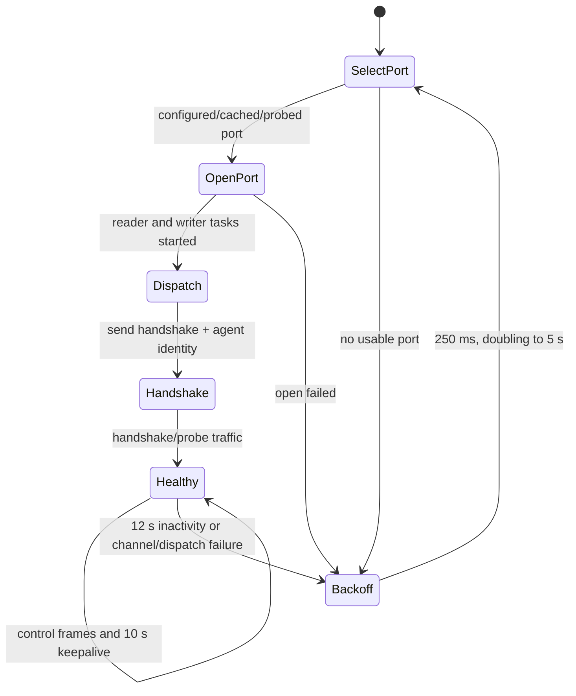
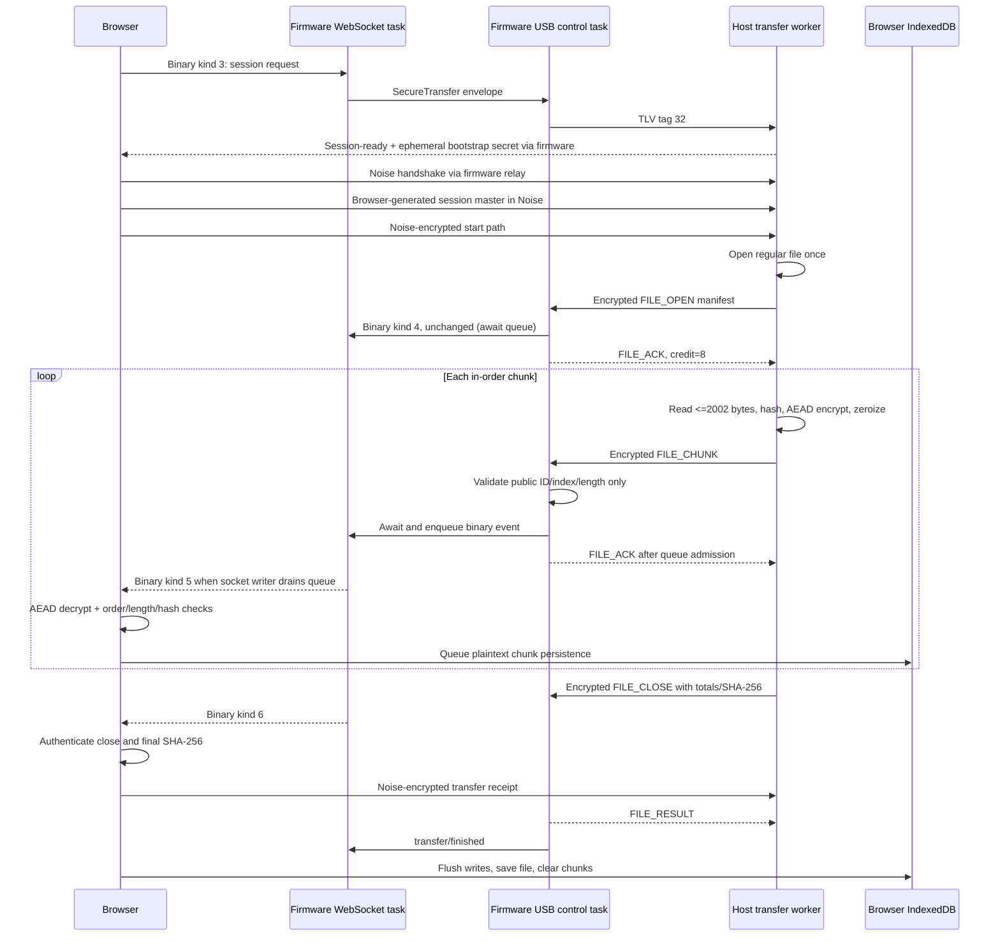
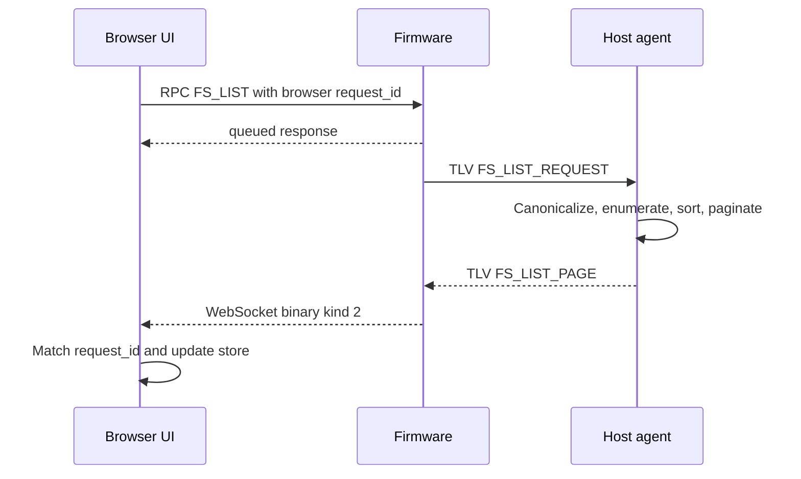
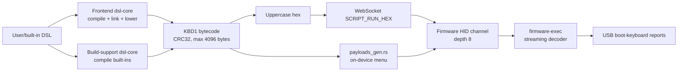

# System architecture

This document explains how the firmware, embedded Web UI, host agent, and shared DSL crates fit together. Wire formats and numeric constants live in [PROTOCOL.md](PROTOCOL.md); board wiring and memory layout live in [HARDWARE.md](HARDWARE.md).

## System context

The Pico is the center of the system. It is simultaneously:

- A Wi-Fi access point and HTTP/WebSocket server for the browser UI.
- A composite USB device exposing logging, control, keyboard, and mass-storage interfaces.
- A relay between browser requests and privileged host-agent operations.
- A bounded keyboard-bytecode executor and on-device display controller.

The browser never accesses the host filesystem directly. For filesystem and transfer workflows it asks firmware over WebSocket; firmware sends a bounded USB control message; the host agent performs the operation and returns a bounded response. The on-device daemon page uses the same control path for shell and credential requests. The capability handshake exposes whether the agent is currently present before dependent workflows are enabled.

## Workspace components

### Firmware

Package: `pico_rust`, source under `firmware/`.

Key responsibilities:

- Board, CYW43, network, display, PSRAM, and flash initialization in `firmware/src/main.rs`.
- Composite USB session management in `firmware/src/usb/`.
- HTTP/WebSocket serving in `firmware/src/http/`.
- Capability and host-agent health snapshots in `firmware/src/capabilities.rs`.
- Persistent USB identity in `firmware/src/device_config.rs`.
- Host-to-browser transfer relay in `firmware/src/usb/ctrl/relay*.rs`.

The firmware is `no_std`, uses Embassy tasks, and relies on fixed-capacity `heapless` collections, static buffers, channels, mutexes, and atomics. Capacity is an architectural constraint, not merely an optimization.

### Frontend

Package: `frontend`, source under `apps/frontend/`.

Key responsibilities:

- Yew state and UI lifecycle in `src/app.rs`.
- A single reconnecting WebSocket and correlated RPC in `src/api.rs`.
- Pure transfer and filesystem decoding/state in `src/transfer/` and `src/filesystem.rs`.
- Browser chunk persistence and save/download behavior in `ui/idb.js`.
- Browser-side DSL compilation in `src/dsl.rs`.

The frontend is compiled to `wasm32-unknown-unknown` by Trunk. It is served from firmware in production and by the Trunk development server during local work.

### Host agent

Package: `host-agent`, source under `apps/host-agent/`.

Key responsibilities:

- Serial-port selection, caching, probing, reading, and writing.
- Connection retry and liveness.
- Host command execution and bounded output.
- Native credential prompting.
- Paginated filesystem access.
- Windowed, checksummed file sending.

The daemon is Tokio-based. Platform-specific behavior is isolated with `cfg` gates; macOS has pseudo-terminal end-to-end tests and a native credential dialog path.

### Shared crates

`dsl-core` owns parsing, preprocessing, script linking, layout-aware lowering, and `KBD1` encoding. `firmware-exec` intentionally contains a small streaming decoder/executor rather than the full compiler.

## Build-time architecture

The firmware build is a multi-target pipeline. The outer Cargo invocation targets Cortex-M; its build script launches an inner wasm build.

`crates/build-support` performs four important jobs:

1. Copies `firmware/memory.x` into `OUT_DIR` and adds it to the linker search path.
2. Fingerprints frontend and DSL sources, runs `trunk build --release` when stale, and copies assets to stable generated names.
3. Compiles built-in scripts into `payloads_gen.rs` for the on-device display.
4. Constructs `host-agent.img`, an 8 MiB read-only FAT16 image embedded in its own flash region.

The inner Trunk process receives a separate target directory and a scrubbed environment so Cortex-M linker flags cannot leak into wasm. Generated files in `OUT_DIR` are inputs to the final firmware link and must not be edited manually.

Build identifiers:

- Firmware semantic version comes from `firmware/Cargo.toml`.
- `PICO_FIRMWARE_BUILD` may supply a release/build identifier.
- Without the override, build support uses `<package-version>-<Cargo-profile>`.

## Firmware startup sequence

Runtime orchestration is in `firmware/src/main.rs`.

USB is currently enabled automatically so logging and control interfaces appear during boot. WebSocket commands can detach and re-enable the composite session. USB class futures run together; a supervisor cancellation stops the full composite device, not a single interface.

The HTTP worker pool has four Embassy tasks sharing the picoserve router. Routes are:

- `/`, `/ui`, and `/ui/*` for embedded frontend assets.
- `/health` for a plain-text health probe.
- `/ws` for all application commands and asynchronous events.

## Browser connection and request lifecycle

The frontend owns exactly one logical WebSocket in `apps/frontend/src/api.rs`.

Request lifecycle:

1. `send_cmd` requires an open socket, allocates a per-session request ID, and inserts a oneshot sender into the pending map.
2. It sends `RPC <id> <command>` and arms a timer.
3. Firmware executes the command and wraps its JSON value in `command/response` with the same ID.
4. The frontend removes the matching pending entry and completes the caller.
5. Read operations time out after 5 seconds; mutations and queue requests after 10 seconds.
6. Error, close, or socket replacement completes all pending callers with a typed cancellation error.

Each WebSocket instance has a monotonically increasing frontend session ID. Callbacks, timeouts, and close events verify that ID before mutating current state, preventing a stale socket from completing a new session's requests.

Reconnect behavior:

- First retry delay: 500 ms.
- Exponential growth to a 5-second maximum.
- Only one retry timer may be scheduled.
- A successful `open` resets delay to 500 ms.
- Yew clears capability/pending UI state on disconnect and refreshes `HELLO`, status, and config after reconnect.
- Status is polled every 5 seconds only while connected.

Filesystem page delivery is asynchronous: the queueing RPC returns first, then a binary page with its own filesystem `request_id` arrives. The Yew store ignores stale page IDs and applies a 15-second page timeout.

## Host-agent discovery and health lifecycle

The host agent has two related state machines: serial reconnection on the host and agent-health projection on firmware.

Port selection, in order:

1. Explicit `--port`.
2. Optional VID/PID filtering.
3. Cached port if it still probes as control/quiet.
4. A unique preferred callout/USB port.
5. Active TLV probing when multiple USB candidates exist.

The cached port is removed after a connected dispatch loop ends. The outer daemon starts with 250 ms retry delay and doubles to 5 seconds; a successful port/session resets it to 250 ms.

Firmware health behavior:

- A new control CDC connection clears the previous agent state.
- `AGENT_STATUS` records version/hostname and the current monotonic time.
- Status requests also mark the agent seen.
- `HELLO.host_agent.present` becomes false after 25 seconds without a mark.
- Receiving a new status queues an updated `HELLO` for the browser.
- Legacy agents that send only a hostname remain visible with a missing version.

The presence flag is a freshness signal, not authentication. It says that a process speaking the expected control protocol was recently observed.

## File-transfer path and backpressure

The transfer path sends a host file to a browser download through the Pico. The browser and host agent are the cryptographic endpoints. Firmware relays the unattended bootstrap secret and ciphertext, never stores the whole file, and never receives the session master or a file key. See [SECURE_FILE_TRANSFER.md](SECURE_FILE_TRANSFER.md) for the trust model and lifecycle.

Backpressure boundaries:

- Host sender initially permits eight in-flight chunks and obeys firmware credit, clamped to 1–64.
- Firmware accepts chunks strictly in order.
- In relay mode, firmware awaits capacity in the 16-event WebSocket channel before sending the USB ACK.
- If the last browser disconnects, firmware drains the queue to wake blocked producers; the producer observes no active client and aborts the transfer.
- WebSocket transmission is downstream of queue admission. USB ACK does not wait for browser decryption, IndexedDB persistence, or final hash verification.
- Browser persistence is batched in JavaScript. Finalization explicitly waits for the persistence queue before saving.
- Host completion additionally requires the connected browser's Noise-encrypted receipt with a matching SHA-256.

The receipt proves authenticated browser processing through the final hash, but not durable filesystem storage or successful user handling of the save dialog.

Legacy simulation/drop mode is disabled for secure v2 because it cannot produce an authenticated browser receipt.

## Filesystem request path

Starting a new browser request cancels the previous request ID on a best-effort basis. The host performs directory enumeration in `spawn_blocking` and suppresses a page when cancellation is observed before send. Pagination is both entry-count bounded and TLV-byte bounded.

## DSL compile and execute paths

There are two compile-time entry points and one device executor.

Browser path:

1. `dsl-core` preprocesses functions/constants/repeats, links built-in calls, requires a leading layout declaration, and lowers text to HID usages.
2. It normalizes flat operations and emits `KBD1` bytecode with magic, reserved flags, operations, `END`, and CRC32.
3. The frontend hex-encodes at most 4096 bytes and sends `SCRIPT_RUN_HEX`.
4. Firmware decodes hex into a fixed-capacity buffer and tries to enqueue it on the HID channel.
5. `firmware-exec` streams delay/tap operations into USB boot-keyboard reports and caps decoded operations at 20,000.

Build path:

- `crates/build-support/src/payloads.rs` compiles every `builtin-scripts` entry during firmware build.
- Generated byte arrays and DSL descriptions are included by the display payload page.
- Selecting a payload on-device enqueues the same `HidCommand::RunBytecode` used by WebSocket scripts.

Layouts affect compile-time text-to-key mapping only. Firmware bytecode remains layout-agnostic.

## State ownership and concurrency

| State | Owner | Synchronization/lifetime |
| --- | --- | --- |
| WebSocket socket, callbacks, RPC pending map | Browser `api.rs` | Browser thread-local `RefCell`/`Cell`; session IDs reject stale callbacks |
| Yew UI models | Browser `app.rs` | Yew state handles; pure stores behind mutable refs |
| Transfer chunks | Browser IndexedDB | Serialized/batched JavaScript persistence queue |
| Transfer relay states | Firmware USB control task | Task-local fixed-capacity vector, maximum four |
| WebSocket transfer queue | Firmware | Embassy channel, depth 16, shared across active clients |
| USB/HID commands | Firmware | Embassy channels, each depth 8 |
| Host-agent health | Firmware | Critical-section mutex plus atomics with 25-second freshness |
| Persistent USB identity | Firmware | Embassy mutex plus two alternating flash slots |
| Serial frames | Host agent | Tokio MPSC reader/writer queues, each depth 64 |
| Transfer requests/feedback | Host agent | Tokio MPSC queues, depths 32 and 128 |
| Filesystem cancellations | Host agent | `Arc<Mutex<HashSet>>` registry |

When adding a feature, keep ownership at one layer and pass bounded messages across boundaries. Avoid introducing a second WebSocket owner, bypassing the USB control task, or sharing mutable firmware state without an existing Embassy/static synchronization pattern.

## Failure containment

- Firmware rejects oversized TLV, bytecode, path, filename, and WebSocket payloads before copying into fixed buffers.
- Unknown USB tags and many malformed frames are logged/ignored rather than panicking.
- Host serial and dispatch errors return to the reconnect loop.
- Browser requests have typed send, timeout, cancellation, protocol, and remote errors.
- Secure transfer records use ChaCha20-Poly1305 authentication; the browser also enforces ordering/size and checks the final streamed SHA-256 before issuing its encrypted receipt.
- Filesystem errors are encoded as status pages rather than terminating the host agent.
- Display initialization is best effort; buttons and LED continue if the ST7789 fails.
- PSRAM detection is best effort; HTTP has SRAM fallback buffers.

## Where to make changes

| Change | Primary source | Other required review |
| --- | --- | --- |
| New WebSocket command | `firmware/src/http/routes/ws.rs`, `apps/frontend/src/api.rs` | Capability advertisement, UI state, timeouts, protocol docs |
| New host operation | Firmware WebSocket/control routing and `apps/host-agent/src/dispatch.rs` | TLV tag/payload, security, host health gating, tests |
| Transfer behavior | Host `file_transfer.rs`, firmware `usb/ctrl/relay*.rs`, frontend `transfer/` | All three state machines and protocol tests |
| Filesystem behavior | Host `filesystem.rs`, frontend `filesystem.rs` | Firmware forwarding, cancellation, byte caps |
| DSL syntax/layout | `crates/dsl/dsl-core` | Frontend compiler, build-support payloads, DSL docs, executor compatibility |
| USB composition | `firmware/src/usb/task.rs` | Interface-count env limits, host port selection, hardware smoke tests |
| Memory allocation/layout | `firmware/memory.x`, `device_config.rs`, `psram_pool.rs`, HTTP buffers | Linker build, size report, persistence/MSC boundaries |
| Startup ordering | `firmware/src/main.rs` and supervisor tasks | Static resource ownership and hardware recovery |
