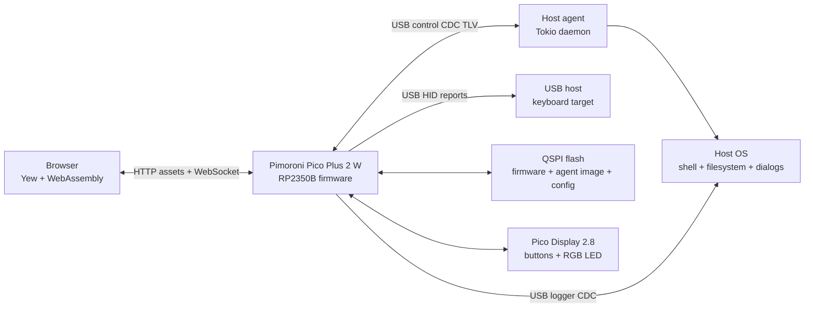
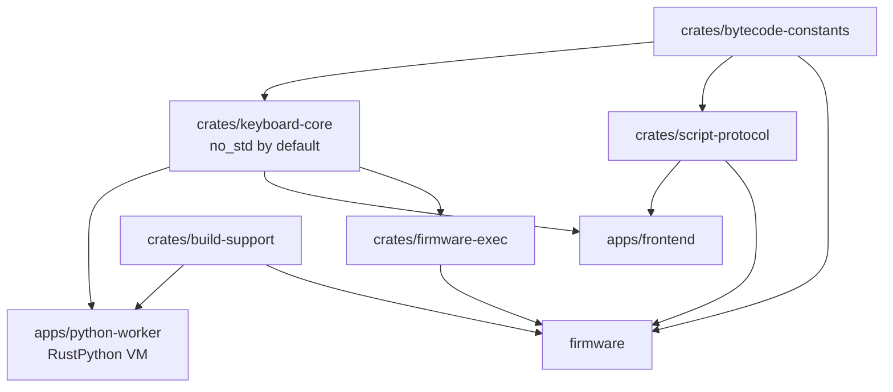
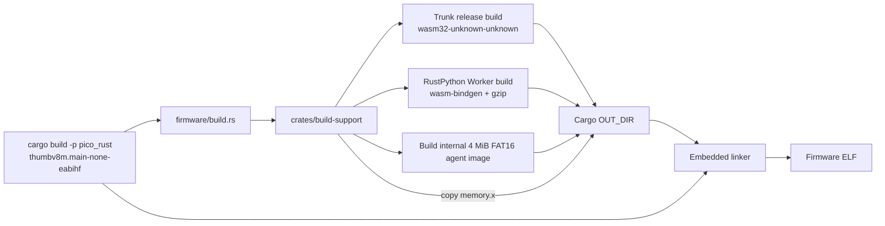
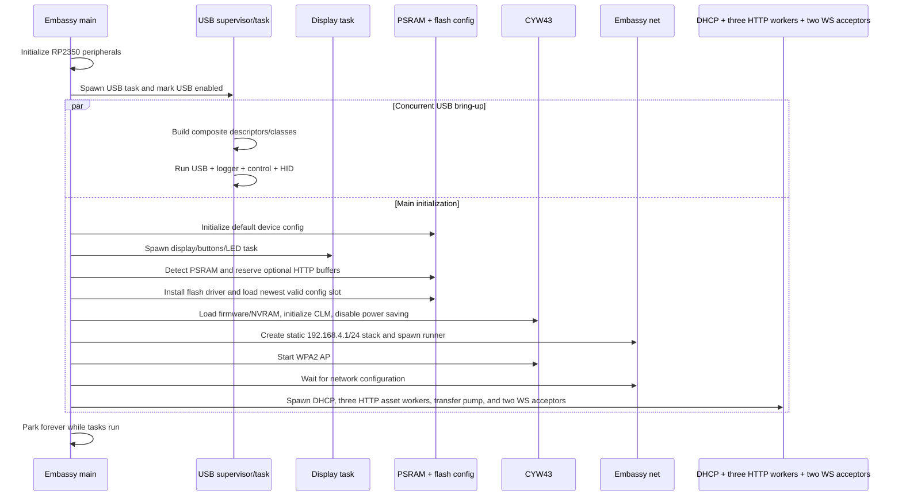
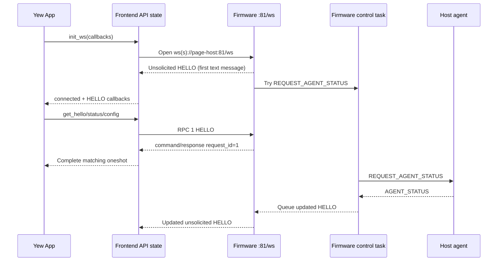
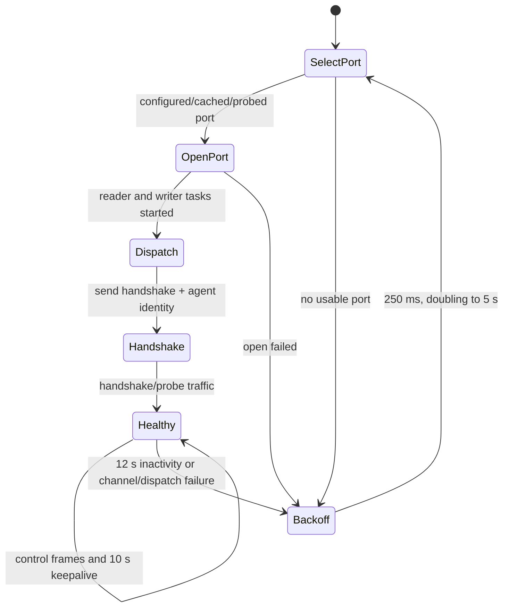
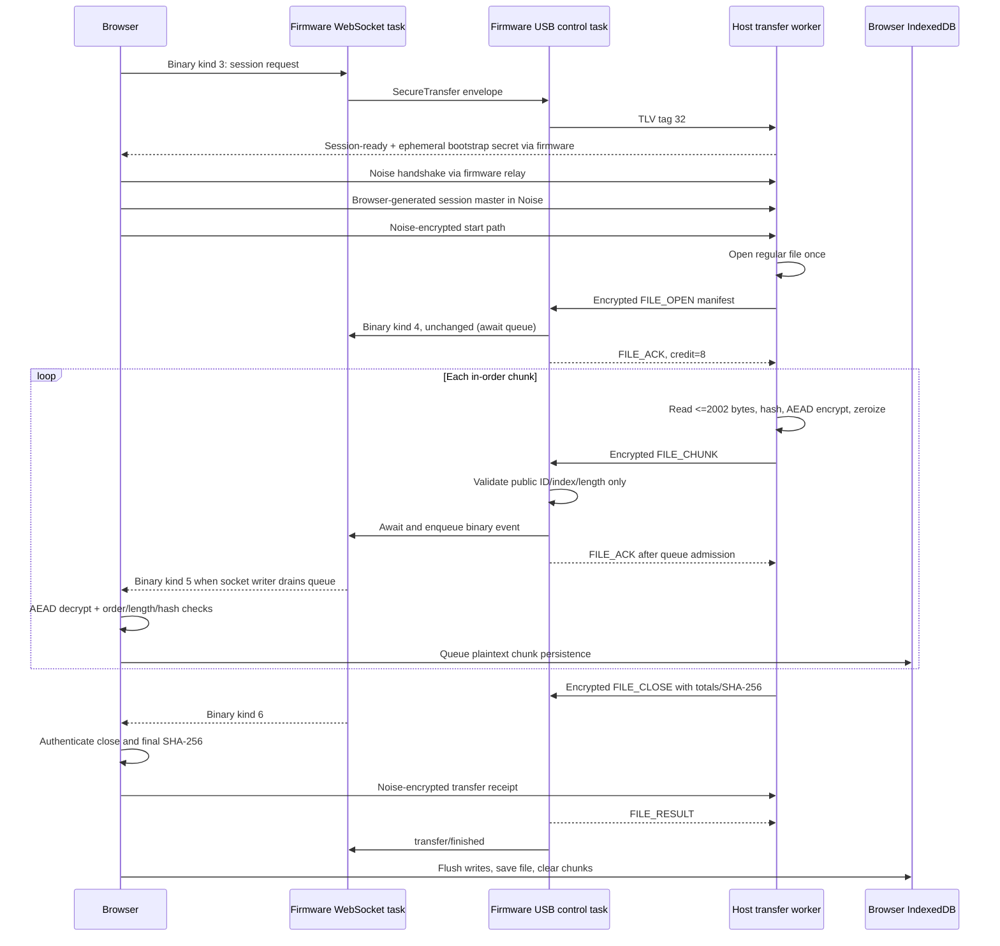
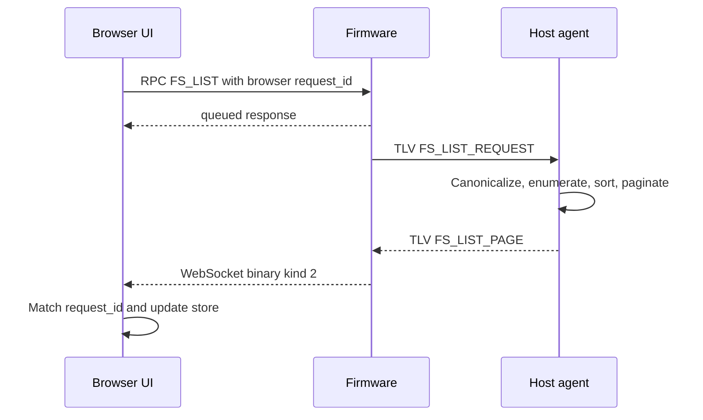

# System architecture

This document explains how the firmware, embedded Web UI, RustPython Worker, host agent, and shared crates fit together. Wire formats and numeric constants live in [PROTOCOL.md](PROTOCOL.md); board wiring and memory layout live in [HARDWARE.md](HARDWARE.md).

## System context

The Pico is the center of the system. It is simultaneously:

- A Wi-Fi access point and HTTP/WebSocket server for the browser UI.
- A composite USB device exposing logging, control, and keyboard interfaces.
- A relay between browser requests and privileged host-agent operations.
- A bounded keyboard-bytecode executor and on-device display controller.

```mermaid
flowchart LR
    Browser["Browser<br/>Yew + WebAssembly"]
    Pico["Pimoroni Pico Plus 2 W<br/>RP2350B firmware"]
    Agent["Host agent<br/>Tokio daemon"]
    HostOS["Host OS<br/>shell + filesystem + dialogs"]
    KeyboardTarget["USB host<br/>keyboard target"]
    Flash["QSPI flash<br/>firmware + agent image + config"]
    Display["Pico Display 2.8<br/>buttons + RGB LED"]

    Browser <-->|HTTP assets + WebSocket| Pico
    Pico <-->|USB control CDC TLV| Agent
    Agent --> HostOS
    Pico -->|USB HID reports| KeyboardTarget
    Pico -->|USB logger CDC| HostOS
    Pico <--> Flash
    Pico <--> Display
```

The browser never accesses the host filesystem directly. For filesystem and transfer workflows it asks firmware over WebSocket; firmware sends a bounded USB control message; the host agent performs the operation and returns a bounded response. The on-device daemon page uses the same control path for shell and credential requests. The capability handshake exposes whether the agent is currently present before dependent workflows are enabled.

## Workspace components

### Native companion prototype

Package: `pico-companion`, under `apps/companion/`; client state lives in
`crates/companion-core`. The prototype currently supports only an explicit mock
transport and does not communicate with Pico hardware. It runs a native egui
window without a browser or local HTTP server. The existing WLAN frontend and
firmware services remain the production paths.

The UI sends bounded commands to a dedicated Tokio backend: 16 normal commands
and four urgent cancellation/disconnect commands. A watch channel coalesces
presentation snapshots rather than queueing every status update. The client
owns request IDs, connection incarnations, deadlines, control admission, and a
128-entry diagnostic ring containing static messages, never typed text. Both
transport replies and queued UI commands are checked against the current
connection incarnation; reconnection does not replay effects or acquire control.
Shutdown interrupts pending work and joins the backend thread.

The mock validates the existing correlated `script-protocol` envelope and KBD1
through `firmware-exec`. It simulates discovery, status, control and execution;
it does not implement or validate BLE pairing, packet transport, or USB timing.
Python remains in the browser Worker. See the
[companion README](../apps/companion/README.md) and
[BLE implementation plan](../NATIVE_COMPANION_BLE_PLAN.md).

### Firmware

Package: `pico_rust`, source under `firmware/`.

Key responsibilities:

- Board, CYW43, network, display, PSRAM, and flash initialization in `firmware/src/main.rs`.
- Composite USB session management in `firmware/src/usb/`.
- HTTP/WebSocket serving in `firmware/src/http/`.
- Capability and host-agent health snapshots in `firmware/src/capabilities.rs`.
- Persistent USB identity in `firmware/src/device_config.rs`.
- Host-to-browser transfer relay in `firmware/src/usb/ctrl/relay*.rs`.

The firmware is `no_std`, uses Embassy tasks, and relies on fixed-capacity `heapless` collections, static buffers, channels, mutexes, and atomics. Capacity is an architectural constraint, not merely an optimization.

### Frontend

Package: `frontend`, source under `apps/frontend/`.

Key responsibilities:

- Yew state and UI lifecycle in `src/app.rs`.
- A single reconnecting WebSocket and correlated RPC in `src/api.rs`.
- Pure transfer and filesystem decoding/state in `src/transfer/` and `src/filesystem.rs`.
- Browser chunk persistence and save/download behavior in `ui/idb.js`.
- RustPython Worker supervision, typed effects, timeouts, and reconnect handling in `src/python.rs`.

The frontend is compiled to `wasm32-unknown-unknown` by Trunk. It is served from firmware in production and by the Trunk development server during local work.

### Host agent

Package: `host-agent`, source under `apps/host-agent/`.

Key responsibilities:

- Serial-port selection, caching, probing, reading, and writing.
- Connection retry and liveness.
- Host command execution and bounded output.
- Native credential prompting.
- Paginated filesystem access.
- Windowed, checksummed file sending.

The daemon is Tokio-based. Platform-specific behavior is isolated with `cfg` gates; macOS has pseudo-terminal end-to-end tests and a native credential dialog path.

### Shared crates

```mermaid
flowchart TD
    PythonWorker["apps/python-worker<br/>RustPython VM"]
    KeyboardCore["crates/keyboard-core<br/>no_std by default"]
    FirmwareExec[crates/firmware-exec]
    ScriptProtocol[crates/script-protocol]
    Constants[crates/bytecode-constants]
    BuildSupport[crates/build-support]
    Frontend[apps/frontend]
    Firmware[firmware]

    BuildSupport --> PythonWorker
    BuildSupport --> Firmware
    KeyboardCore --> PythonWorker
    KeyboardCore --> Frontend
    KeyboardCore --> FirmwareExec
    ScriptProtocol --> Frontend
    ScriptProtocol --> Firmware
    Constants --> KeyboardCore
    Constants --> ScriptProtocol
    Constants --> Firmware
    FirmwareExec --> Firmware
```

RustPython owns Python parsing, bytecode, generator frames, and exceptions inside a dedicated browser Worker. `keyboard-core` converts typed yielded effects into bounded, layout-aware `KBD1`. `firmware-exec` validates the complete KBD1 program before emitting any report and then executes it asynchronously.

## Build-time architecture

The firmware build is a multi-target pipeline. The outer Cargo invocation targets Cortex-M; its build script launches an inner wasm build.

```mermaid
flowchart LR
    Cargo["cargo build -p pico_rust<br/>thumbv8m.main-none-eabihf"]
    BuildRS[firmware/build.rs]
    Support[crates/build-support]
    Trunk["Trunk release build<br/>wasm32-unknown-unknown"]
    Python["RustPython Worker build<br/>wasm-bindgen + gzip"]
    MSC[Build internal 4 MiB FAT16 agent image]
    Out[Cargo OUT_DIR]
    Link[Embedded linker]
    ELF[Firmware ELF]

    Cargo --> BuildRS --> Support
    Support --> Trunk --> Out
    Support --> Python --> Out
    Support --> MSC --> Out
    Support -->|copy memory.x| Out
    Out --> Link
    Cargo --> Link --> ELF
```

`crates/build-support` performs four important jobs:

1. Copies `firmware/memory.x` into `OUT_DIR` and adds it to the linker search path.
2. Fingerprints the frontend and Python Worker, runs `trunk build --release`, builds the pinned RustPython Worker, applies wasm-bindgen, and stores all embedded frontend and Worker assets as deterministic gzip, served with `Content-Encoding: gzip`. It never embeds the shared `apps/frontend/dist/` development output.
3. Generates stable `include_*` bindings for the main UI, Worker driver/glue, and compressed Worker WASM.
4. Constructs `host-agent.img`, a 4 MiB read-only FAT16 image embedded in its own flash region.

The inner Trunk process receives a separate target directory and a scrubbed environment so Cortex-M linker flags cannot leak into wasm. Generated files in `OUT_DIR` are inputs to the final firmware link and must not be edited manually.

Build identifiers:

- Firmware semantic version comes from `firmware/Cargo.toml`.
- `PICO_FIRMWARE_BUILD` may supply a release/build identifier.
- Without the override, build support uses `<package-version>-<Cargo-profile>`.

## Firmware startup sequence

Runtime orchestration is in `firmware/src/main.rs`.

```mermaid
sequenceDiagram
    participant Main as Embassy main
    participant USB as USB supervisor/task
    participant Display as Display task
    participant Storage as PSRAM + flash config
    participant CYW as CYW43
    participant Net as Embassy net
    participant HTTP as DHCP + three HTTP workers + two WS acceptors

    Main->>Main: Initialize RP2350 peripherals
    Main->>USB: Spawn USB task and mark USB enabled
    par Concurrent USB bring-up
        USB->>USB: Build composite descriptors/classes
        USB->>USB: Run USB + logger + control + HID
    and Main initialization
        Main->>Storage: Initialize default device config
        Main->>Display: Spawn display/buttons/LED task
        Main->>Storage: Detect PSRAM and reserve optional HTTP buffers
        Main->>Storage: Install flash driver and load newest valid config slot
        Main->>CYW: Load firmware/NVRAM, initialize CLM, disable power saving
        Main->>Net: Create static 192.168.4.1/24 stack and spawn runner
        Main->>CYW: Start WPA2 AP
        Main->>Net: Wait for network configuration
        Main->>HTTP: Spawn DHCP, three HTTP asset workers, transfer pump, and two WS acceptors
    end
    Main->>Main: Park forever while tasks run
```

USB is currently enabled automatically so logging and control interfaces appear during boot. WebSocket commands can detach and re-enable the composite session. USB class futures run together; a supervisor cancellation stops the full composite device, not a single interface.

Three HTTP Embassy tasks share the asset router. Two independent picoserve acceptors serve the WebSocket router so a stale TCP/WebSocket connection cannot monopolize port 81. Routes are:

- `/`, `/ui`, and `/ui/*` for embedded frontend assets.
- `/health` for a plain-text health probe.
- Port 81 `/ws` for all application commands and asynchronous events.

## Browser connection and request lifecycle

The frontend owns exactly one logical WebSocket in `apps/frontend/src/api.rs`.

```mermaid
sequenceDiagram
    participant UI as Yew App
    participant API as Frontend API state
    participant WS as Firmware :81/ws
    participant USB as Firmware control task
    participant Agent as Host agent

    UI->>API: init_ws(callbacks)
    API->>WS: Open ws(s)://page-host:81/ws
    WS-->>API: Unsolicited HELLO (first text message)
    WS->>USB: Try REQUEST_AGENT_STATUS
    API-->>UI: connected + HELLO callbacks
    UI->>API: get_hello/status/config
    API->>WS: RPC 1 HELLO
    WS-->>API: command/response request_id=1
    API-->>UI: Complete matching oneshot
    USB->>Agent: REQUEST_AGENT_STATUS
    Agent-->>USB: AGENT_STATUS
    USB-->>WS: Queue updated HELLO
    WS-->>API: Updated unsolicited HELLO
```

Request lifecycle:

1. `send_cmd` requires an open socket, allocates a per-session request ID, and inserts a oneshot sender into the pending map.
2. It sends `RPC <id> <command>` and arms a timer.
3. Firmware executes the command and wraps its JSON value in `command/response` with the same ID.
4. The frontend removes the matching pending entry and completes the caller.
5. Read operations time out after 5 seconds; mutations and queue requests after 10 seconds.
6. Error, close, or socket replacement completes all pending callers with a typed cancellation error.

Each WebSocket instance has a monotonically increasing frontend session ID. Callbacks, timeouts, and close events verify that ID before mutating current state, preventing a stale socket from completing a new session's requests.

Firmware also assigns a monotonically increasing generation to each accepted WebSocket. The newest connection becomes the sole logical owner of commands and transfer output. Bounded transfer events carry that generation, preventing an item already held by the batching task from crossing a handoff. A new owner wakes the previous callback immediately, which closes with private status code `4001` instead of waiting for the socket timeout. A frontend closed with that code pauses automatic reconnect so an older tab cannot continually displace the newer one.

Reconnect behavior:

- First retry delay: 500 ms.
- Exponential growth to a 5-second maximum.
- A connection attempt that remains in `CONNECTING` for 3 seconds is closed and retried.
- Close code `4001` pauses retries until the page is explicitly refreshed.
- Only one retry timer may be scheduled.
- A successful `open` resets delay to 500 ms.
- Yew clears capability/pending UI state on disconnect and refreshes `HELLO`, status, and config after reconnect.
- Status is polled every 5 seconds only while connected.

Filesystem page delivery is asynchronous: the queueing RPC returns first, then a binary page with its own filesystem `request_id` arrives. The Yew store ignores stale page IDs and applies a 15-second page timeout.

## Host-agent discovery and health lifecycle

The host agent has two related state machines: serial reconnection on the host and agent-health projection on firmware.

```mermaid
stateDiagram-v2
    [*] --> SelectPort
    SelectPort --> OpenPort: configured/cached/probed port
    SelectPort --> Backoff: no usable port
    OpenPort --> Dispatch: reader and writer tasks started
    OpenPort --> Backoff: open failed
    Dispatch --> Handshake: send handshake + agent identity
    Handshake --> Healthy: handshake/probe traffic
    Healthy --> Healthy: control frames and 10 s keepalive
    Healthy --> Backoff: 12 s inactivity or channel/dispatch failure
    Backoff --> SelectPort: 250 ms, doubling to 5 s
```

Port selection, in order:

1. Explicit `--port`.
2. Optional VID/PID filtering.
3. Cached port if it still probes as control/quiet.
4. A unique preferred callout/USB port.
5. Active TLV probing when multiple USB candidates exist.

The cached port is removed after a connected dispatch loop ends. The outer daemon starts with 250 ms retry delay and doubles to 5 seconds; a successful port/session resets it to 250 ms.

Firmware health behavior:

- A new control CDC connection clears the previous agent state.
- `AGENT_STATUS` records version/hostname and the current monotonic time.
- `HOST_OS` records the agent target platform separately so the identity payload remains compatible with older firmware.
- Status requests also mark the agent seen.
- `HELLO.host_agent.present` becomes false after 25 seconds without a mark.
- Receiving a new status queues an updated `HELLO` for the browser.
- Legacy agents that send only a hostname remain visible with a missing version.

The presence flag is a freshness signal, not authentication. It says that a process speaking the expected control protocol was recently observed.

## File-transfer path and backpressure

The transfer path sends a host file to a browser download through the Pico. The browser and host agent are the cryptographic endpoints. Firmware relays the unattended bootstrap secret and ciphertext, never stores the whole file, and never receives the session master or a file key. See [THREAT_MODEL.md](THREAT_MODEL.md) for security assumptions and [PROTOCOL.md](PROTOCOL.md#secure-file-transfer-protocol-v2) for wire formats.

```mermaid
sequenceDiagram
    participant B as Browser
    participant W as Firmware WebSocket task
    participant C as Firmware USB control task
    participant H as Host transfer worker
    participant DB as Browser IndexedDB

    B->>W: Binary kind 3: session request
    W->>C: SecureTransfer envelope
    C->>H: TLV tag 32
    H-->>B: Session-ready + ephemeral bootstrap secret via firmware
    B->>H: Noise handshake via firmware relay
    B->>H: Browser-generated session master in Noise
    B->>H: Noise-encrypted start path
    H->>H: Open regular file once
    H->>C: Encrypted FILE_OPEN manifest
    C->>W: Binary kind 4, unchanged (await queue)
    C-->>H: FILE_ACK, credit=8
    loop Each in-order chunk
        H->>H: Read <=2002 bytes, hash, AEAD encrypt, zeroize
        H->>C: Encrypted FILE_CHUNK
        C->>C: Validate public ID/index/length only
        C->>W: Await and enqueue binary event
        C-->>H: FILE_ACK after queue admission
        W-->>B: Binary kind 5 when socket writer drains queue
        B->>B: AEAD decrypt + order/length/hash checks
        B->>DB: Queue plaintext chunk persistence
    end
    H->>C: Encrypted FILE_CLOSE with totals/SHA-256
    W-->>B: Binary kind 6
    B->>B: Authenticate close and final SHA-256
    B->>H: Noise-encrypted transfer receipt
    C-->>H: FILE_RESULT
    C->>W: transfer/finished
    B->>DB: Flush writes, save file, clear chunks
```

Backpressure boundaries:

- Host sender initially permits eight in-flight chunks and obeys firmware credit, clamped to 1–64.
- Firmware accepts chunks strictly in order.
- In relay mode, firmware awaits capacity in the 16-event WebSocket channel before sending the USB ACK.
- If the last browser disconnects, firmware drains the queue to wake blocked producers; the producer observes no active client and aborts the transfer.
- WebSocket transmission is downstream of queue admission. USB ACK does not wait for browser decryption, IndexedDB persistence, or final hash verification.
- Browser persistence is batched in JavaScript. Finalization explicitly waits for the persistence queue before saving.
- Host completion additionally requires the connected browser's Noise-encrypted receipt with a matching SHA-256.

The receipt proves authenticated browser processing through the final hash, but not durable filesystem storage or successful user handling of the save dialog.

Session negotiation is single-use and in memory: the host generates the bootstrap secret and session ID, rate-limits requests to one per two seconds, and expires incomplete negotiation after five minutes. The browser generates the session master after the Noise handshake; the host returns an encrypted fixed confirmation before the browser marks the session ready. A WebSocket reconnect or refresh negotiates a new session.

Each file derives its own key with HKDF-SHA-256 from the session master, random public salt, session ID, and transfer ID. This isolates file keys and keeps the session master out of direct record encryption; record type/index separate nonce domains. Retries reuse the cached ciphertext exactly, never re-encrypting under a reused nonce. The sender opens one regular-file handle, hashes each bounded read as it encrypts, best-effort zeroizes plaintext buffers, and rechecks file length and modification time before close. It retains only bounded ciphertext for retry.

Automatic compression is omitted: already compressed inputs often gain little, content-dependent sizes leak information, and a second transformation adds resource costs. The transfer path omits file paths, names, contents, hashes, and key material from its logs; session secrets are not persisted. Browser file staging remains plaintext in IndexedDB. Best-effort zeroization does not erase OS caches, swap, driver/browser copies, or allocator remnants; the hostile PC can inspect its endpoint regardless.

Legacy simulation/drop mode is disabled for secure v2 because it cannot produce an authenticated browser receipt.

## Filesystem request path

```mermaid
sequenceDiagram
    participant UI as Browser UI
    participant FW as Firmware
    participant HA as Host agent

    UI->>FW: RPC FS_LIST with browser request_id
    FW-->>UI: queued response
    FW->>HA: TLV FS_LIST_REQUEST
    HA->>HA: Canonicalize, enumerate, sort, paginate
    HA-->>FW: TLV FS_LIST_PAGE
    FW-->>UI: WebSocket binary kind 2
    UI->>UI: Match request_id and update store
```

Starting a new browser request cancels the previous request ID on a best-effort basis. The host performs directory enumeration in `spawn_blocking` and suppresses a page when cancellation is observed before send. Pagination is both entry-count bounded and TLV-byte bounded.

## RustPython process and effect path

One real RustPython generator runs in a dedicated browser Worker. Python state survives WebSocket disconnects as long as the tab remains open. The API, exceptions, enforced limits, and Worker message lifecycle are documented in [SCRIPTING.md](SCRIPTING.md).

```mermaid
flowchart LR
    Python["RustPython generator<br/>send / throw"]
    Supervisor["Frontend supervisor<br/>deadline + one effect"]
    Keyboard["keyboard-core<br/>layout-aware lowering"]
    KBD1["KBD1 bytecode<br/>CRC32, max 4096 bytes"]
    WS["Binary kind 8<br/>correlated IDs"]
    HIDQ["Firmware HID command channel<br/>depth 1"]
    Exec["firmware-exec<br/>validate, then execute"]
    Reports[USB boot-keyboard reports]

    Python -->|keyboard effect in Worker| Keyboard --> KBD1 --> Supervisor
    Supervisor --> WS --> HIDQ --> Exec --> Reports
    Exec -->|completed/rejected/cancelled| Supervisor
    Supervisor -->|send(value) / throw(error)| Python
```

Process path:

1. The Worker compiles user source with RustPython 0.6, requires a module-scope `layout()` call, and calls `main()` to obtain a generator.
2. Initialization, compilation, and the first yield share a 30-second deadline; subsequent resume/raise steps have 500 ms. The frontend terminates the Worker when a deadline expires.
3. Local sleep/event effects remain in the browser. The Worker lowers keyboard effects through `keyboard-core` and returns KBD1 to the frontend for validation and transport.
4. Binary kind 8 carries exact request, process, and effect IDs plus up to 4,096 KBD1 bytes.
5. Firmware validates flags, canonical varints, usages, delays, operation count, `END` placement, trailing data, and CRC before emitting the first HID report.
6. Completion resumes the generator. Disconnects, unavailable USB/host-agent capability, rejection, firmware cancellation, and device-effect timeout are injected with `generator.throw()` and can be caught by Python. The Web UI Stop action immediately terminates the Worker after best-effort device cancellation; it does not resume Python cleanup.

The browser never retries a keyboard effect because its outcome may be unknown after disconnect. Closing/reloading the tab terminates the Worker; no Python state is persisted to the Pico.

### Firmware-resident keyboard presets

`crates/build-support/src/presets.rs` defines typed Rust keyboard operations and
lowers them with `keyboard-core` during the firmware build. Generated static KBD1
and bounded metadata are included by the display service adapter. Launcher paths
and availability come from the same normalized volume label and target metadata
that build the internal agent image. The firmware adds no interpreter, heap allocation, or
second bytecode format. Python remains a browser-resident process.

Build-time validation requires 1–64 presets with names of 1–96 printable ASCII
characters. Preset metadata remains in flash; visible-row storage is bounded
independently of catalog size.

`usb/hid.rs` is the sole execution service for local presets and browser effects.
The allocation-free `firmware-exec::jobs::Controller` reserves one firmware-issued
job handle before queueing, then transitions Queued → Running → Releasing → Idle.
New requests are rejected while any job is reserved. Cancellation is a sticky flag
scoped to that handle; browser requests additionally match WebSocket generation,
process and effect IDs. Session teardown cancels only that session's job. Display
Y explicitly stops any active owner. Presets retain ownership for the whole sequence.

The execution future is raced against matching cancellation and USB link loss.
Terminal decisions commit once, before an all-zero report with a 250 ms timeout.
Failed cleanup closes readiness; after USB reconnect a successful zero report is
required before admission reopens. Bus reset/disconfiguration closes admission even
during a programmed delay. Dropping the USB task also clears reserved/queued work.
Local completion goes to a dedicated signal, independent of a browser. A singleton
completion task and one small completion slot survive USB task shutdown, claim each
result once, and keep admission closed until browser delivery is enqueued or the
originating session disappears. Browser completion uses the existing bounded event
queue with backpressure and the original
session generation; a replacement socket cannot receive an old job's result.

The display reports keyboard completion separately from host-agent detection and
waits up to 15 seconds for the latter. Local controls are consumed before publishing
button events to Python, preventing one press from triggering two keyboard producers.

The hardware display is split between `firmware/src/display/` and
`firmware/src/display_core/`. The former owns GPIO, panel transport, ADC/linker
metrics, and adapters to HID, USB control, and host-agent state. The latter is an
allocation-free module also exported by the firmware library for native tests.
It accepts raw button samples and service snapshots, updates page models, and
returns bounded action intents. Models and drawing never access device globals.

Menu gestures retain ownership until both A and X are released. Device-wide Y
Stop wins over simultaneous X activation. Local completion is consumed once per
50 ms display tick regardless of which page is visible; the internal completion
timestamp anchors the 15-second handshake deadline. Transfer byte/chunk progress
is coalesced to 10 Hz, while identity, connection, and terminal changes bypass
that limit. The HID job controller and browser wire format remain unchanged.

Typed `PageView` variants bind page identity to its data. Shared widgets generate
at most 20 bounded text rows for the visible page. The renderer caches only the
previously drawn rows and geometry, comparing normalized text, rectangle, font,
and colors before writing SPI. Layout changes invalidate pixels without resetting
selection, status severity, pending handles, or deadlines. Headers and unchanged
rows draw once; list selections repaint only affected rows. Payloads reserves a
footer and derives a scroll window independently of total preset count. Logs
snapshots copy at most 18 tail lines with their generation under one short lock;
SPI drawing happens after that lock has been released.

Panel startup commands and waits are asynchronous. A small board-specific
ST7789 transport preserves the panel setup and uses SPI0 with DMA_CH1;
CYW43 retains DMA_CH0. The renderer prepares an owned, bounded frame, then the
backend rasterizes its damaged rectangles into one 320x8 RGB565 tile (5,120 bytes)
and awaits DMA writes. The pinned flush is selected against the 50 ms input
ticker, so Stop, gestures, local completions, and service state continue updating
while it is pending. Timer ticks borrow the flush rather than cancel it. Models
changed during a flush schedule a subsequent frame. Pixel caches commit only
after successful transmission; failure or an uncommitted frame forces a repaint.
Full-frame backgrounds exclude text rows, avoiding duplicate pixel transfers.

Bounded 30-second diagnostic summaries report frame wall time, maximum tile
rasterization time, SPI writes/bytes, missed sampling ticks, and Stop dispatch
time. Frame wall time includes awaited DMA and scheduling; it is not a measure
of executor blocking. Physical button-release latency requires a board
measurement; diagnostics measure dispatch from the sampling instant.

## State ownership and concurrency

| State | Owner | Synchronization/lifetime |
| --- | --- | --- |
| WebSocket socket, callbacks, RPC pending map | Browser `api.rs` | Browser thread-local `RefCell`/`Cell`; session IDs reject stale callbacks |
| RustPython interpreter/generator | Dedicated browser Worker | One process; hard termination on step timeout or Stop |
| Python effects/events | Browser `python.rs` | One outstanding effect, 32 queued button events, correlated process/step IDs |
| Yew UI models | Browser `app.rs` | Yew state handles; pure stores behind mutable refs |
| Transfer chunks | Browser IndexedDB | Serialized/batched JavaScript persistence queue |
| Transfer relay states | Firmware USB control task | Task-local fixed-capacity vector, maximum four |
| WebSocket transfer data plane | Firmware | Two port-81 acceptors hand off one generation-owned active browser session. A singleton pump owns the 16-event input channel, one-frame output channel, and unique PSRAM batch slot. |
| USB/HID commands/results | Firmware | One command slot (4,096-byte browser effect or flash preset reference), a small job controller, one local-result signal and one browser-completion slot/router task; browser delivery uses the existing generation-owned event queue |
| Host-agent health | Firmware | Critical-section mutex plus atomics with 25-second freshness |
| Hardware display models/cache | Firmware display task | Pure page models, one bounded 20-row renderer cache, and an 18-line log-tail snapshot; local completion/deadlines update even on hidden pages |
| Persistent USB identity | Firmware | Embassy mutex plus two alternating flash slots |
| Serial frames | Host agent | Tokio MPSC reader/writer queues, each depth 64 |
| Transfer requests/feedback | Host agent | Tokio MPSC queues, depths 32 and 128 |
| Filesystem cancellations | Host agent | `Arc<Mutex<HashSet>>` registry |

When adding a feature, keep ownership at one layer and pass bounded messages across boundaries. Avoid introducing a second WebSocket owner, bypassing the USB control task, or sharing mutable firmware state without an existing Embassy/static synchronization pattern.

## Failure containment

The [threat model](THREAT_MODEL.md) treats the USB-connected PC and host-agent instance as hostile, while trusting the Pico firmware and Wi-Fi clients. Host-provided data remains untrusted after successful transfer authentication; encrypted delivery and matching hashes do not establish file provenance. The controls below describe current containment, not a complete malicious-host security audit.

- Firmware rejects oversized TLV, bytecode, path, filename, and WebSocket payloads before copying into fixed buffers.
- Unknown USB tags and many malformed frames are logged/ignored rather than panicking.
- Host serial and dispatch errors return to the reconnect loop.
- Browser requests have typed send, timeout, cancellation, protocol, and remote errors.
- Secure transfer records use ChaCha20-Poly1305 authentication; the browser also enforces ordering/size and checks the final streamed SHA-256 before issuing its encrypted receipt.
- Filesystem errors are encoded as status pages rather than terminating the host agent.
- Display initialization is best effort; buttons and LED continue if the ST7789 fails.
- PSRAM detection is best effort. Three HTTP workers and two WebSocket acceptors normally use disjoint 8 KiB/32 KiB PSRAM TCP windows. Each retains a statically reserved 4 KiB SRAM fallback; batching disables itself if its PSRAM slot is unavailable.
- A six-second hardware watchdog recovers global executor stalls. HTTP/WebSocket stage markers and the retained last stage are reported over the logging CDC interface after reboot.

## Where to make changes

| Change | Primary source | Other required review |
| --- | --- | --- |
| New WebSocket command | `firmware/src/http/routes/ws.rs`, `apps/frontend/src/api.rs` | Capability advertisement, UI state, timeouts, protocol docs |
| New host operation | Firmware WebSocket/control routing and `apps/host-agent/src/dispatch.rs` | TLV tag/payload, security, host health gating, tests |
| Transfer behavior | Host `file_transfer.rs`, firmware `usb/ctrl/relay*.rs`, frontend `transfer/` | All three state machines and protocol tests |
| Filesystem behavior | Host `filesystem.rs`, frontend `filesystem.rs` | Firmware forwarding, cancellation, byte caps |
| Python effects/layout | `apps/python-worker`, `crates/keyboard-core` | Frontend supervisor, Worker protocol, firmware executor compatibility |
| USB composition | `firmware/src/usb/task.rs` | Interface-count env limits, host port selection, hardware smoke tests |
| Hardware display | `firmware/src/display_core/`, `firmware/src/display/` | Input ownership, model/cache separation, bounded rows, native rendering tests, embedded size and board timing |
| Memory allocation/layout | `firmware/memory.x`, `device_config.rs`, `psram_pool.rs`, HTTP buffers | Linker build, size report, persistence/agent-image boundaries |
| Startup ordering | `firmware/src/main.rs` and supervisor tasks | Static resource ownership and hardware recovery |
## CDC installation ownership

`crates/build-support/src/msc_image.rs` records the macOS executable's allocated
flash extent and generates size/SHA-256 metadata. The CDC installer shell source
and short receiver command are maintained in `crates/build-support`; generated
files remain under `OUT_DIR`. The executable stays in the internal FAT image; USB mass storage is not exposed.

`firmware/src/bootstrap_core.rs` owns allocation-free request parsing, ordered
session validation, and logical extent slicing, with host tests. The existing
control task remains the sole CDC owner and routes an explicitly armed session
to `usb/bootstrap.rs`, suppressing ordinary TLV output until clean handoff or
port closure after failure. Arming precedes synchronous HID admission; failure
rolls back the reservation, and HID errors cancel only the associated job.
Browser HID submissions and new control commands return busy during reservation.

The display exposes manual-arm and macOS US/DE CDC install actions. Y Stop covers
the transfer after typing completes. The installer handles host-side staging,
exact reads, digest validation, watchdog cleanup, and serial descriptor closure;
the agent then opens the same port for its ordinary TLV handshake. Additive
HELLO installation status is consumed by the frontend through the existing
central WebSocket connection. Verification and agent detection remain separate.
