# Protocol reference

This document is the canonical wire-level reference for communication between the browser frontend, Pico firmware, and host agent. It describes the formats implemented by the current source. When this document and code disagree, treat code as authoritative and update this document in the same change.

Related documents:

- [Architecture](ARCHITECTURE.md)
- [Hardware](HARDWARE.md)
- [Contributor guidance](../AGENTS.md)
- [Keyboard DSL and bytecode](../crates/dsl/README.md)

## Scope and conventions

There are two application transports:

1. A text/binary WebSocket between the browser and firmware at `/ws`.
2. A TLV byte stream between firmware and the host agent over the USB control CDC-ACM interface.

Unless stated otherwise:

- Multi-byte integers are unsigned and little-endian.
- Lengths are byte lengths.
- Text is UTF-8.
- Array indices and chunk indices are zero-based.
- Reserved bits must be sent as zero and ignored by receivers unless a protocol version says otherwise.
- `D -> H` means device firmware to host agent; `H -> D` means host agent to device firmware.
- `B -> D` means browser to device; `D -> B` means device to browser.

Types used in layout tables:

| Notation | Meaning |
| --- | --- |
| `u8` | One unsigned byte |
| `u16`, `u32`, `u64` | Little-endian unsigned integer |
| `bytes[n]` | Exactly `n` uninterpreted bytes |
| `utf8[n]` | Exactly `n` bytes of UTF-8 text, without a terminator |
| `rest` | All remaining bytes in the containing frame |

## Version inventory

| Surface | Current version | Where carried | Compatibility behavior |
| --- | ---: | --- | --- |
| WebSocket command/event protocol | 1 | `HELLO.protocols.websocket`; response/event `version` fields | The frontend reports a compatibility error when the WebSocket version differs. |
| `HELLO` schema | 1 | Top-level `HELLO.version` | The frontend requires `event_type = "hello"` and `version = 1`. |
| File-transfer protocol | 2 | `FILE_OPEN.protocol_version`; WebSocket transfer event `version` | There is no plaintext downgrade: the host and frontend reject the v1 file path. |
| Filesystem protocol | 1 | First `u16` in list requests and pages | Host agent and frontend reject unsupported versions; firmware refuses to forward mismatched pages. |
| Keyboard bytecode | `KBD1` | Four-byte bytecode magic | Firmware executor rejects other magic values. See the DSL documentation. |
| USB TLV envelope | Unversioned | None | Compatibility is maintained by stable tag numbers and versioned payloads for complex subprotocols. |

Version numbers are independent. A file-transfer or filesystem format change does not automatically require a WebSocket version bump if it is fully capability-gated and backward compatible, but a change to command framing, response correlation, binary-kind routing, or required `HELLO` fields does.

## USB control CDC TLV stream

### Serial and framing

The host opens the USB CDC port as 115200, 8 data bits, no parity, and 1 stop bit. Because CDC-ACM runs over USB, the baud rate is primarily an API setting rather than a physical UART clock.

The byte stream is a sequence of frames:

| Offset | Field | Type | Notes |
| ---: | --- | --- | --- |
| 0 | `tag` | `u8` | Message type from the registry below |
| 1 | `payload_len` | `u32` | Number of payload bytes; maximum 2048 |
| 5 | `payload` | `bytes[payload_len]` | May be empty |

USB packet boundaries have no application meaning. Headers and payloads may be split across USB packets, and multiple frames may be present in a read buffer.

There is no envelope checksum. File-transfer v2 uses ChaCha20-Poly1305 authentication; keyboard bytecode retains its own integrity checks.

Both endpoints reject lengths over 2048 and attempt to resynchronize. The host decoder scans forward for a plausible complete frame; the firmware decoder slides its five-byte header window after an oversized length. A producer must never depend on this recovery behavior.

Implementation:

- Firmware encoder/stream decoder and tag routing: `firmware/src/usb/ctrl.rs`
- Host frame type, encoder, decoder, and resynchronization: `apps/host-agent/src/tlv.rs`
- Host serial reader/writer and control-port probing: `apps/host-agent/src/transport.rs`

### Tag registry

| Tag | Name | Direction | Payload | Status |
| ---: | --- | --- | --- | --- |
| 1 | `EXECUTE` | D -> H | UTF-8 shell command | Active; host executes it and emits tag 9 output. |
| 2 | `DEBUG_MSG` | D -> H | UTF-8 diagnostic text | Active for `handshake-ok`, `probe-ok`, and logs. |
| 3 | `WS_CONNECT` | Legacy/reserved | Unspecified | Recognized by host transport, not handled by current firmware. |
| 4 | `WS_DATA` | Legacy/reserved | Unspecified | Recognized by host transport, not handled by current firmware. |
| 5 | `WS_DISCONNECT` | Legacy/reserved | Unspecified | Recognized by host transport, not handled by current firmware. |
| 6 | `WS_DATA_RECV` | Legacy/reserved | Unspecified | Recognized by host transport, not handled by current firmware. |
| 7 | `REQUEST_AGENT_STATUS` | Bidirectional | Empty, or ASCII `handshake` | Active for discovery, handshake, probes, and keepalive. |
| 8 | `AGENT_STATUS` | H -> D | Versioned agent identity described below | Active. |
| 9 | `EXECUTE_RESULT` | H -> D | Raw output chunk, up to 2048 bytes | Host produces it; current firmware logs it as unhandled. |
| 10 | `MIC_PCM_DATA` | Reserved | Unspecified | Recognized by host transport; no current producer/consumer. |
| 11 | `DB_CREDENTIALS_REQUEST` | D -> H | Optional UTF-8 prompt label | Active. |
| 12 | `DB_CREDENTIALS_RESPONSE` | H -> D | Empty for cancel, otherwise `username + NUL + password` | Active. |
| 20 | `FILE_OPEN` | H -> D | v2 public envelope plus encrypted manifest | Active. |
| 21 | `FILE_CHUNK` | H -> D | v2 public envelope plus AEAD ciphertext | Active. |
| 22 | `FILE_ACK` | D -> H | Contiguous progress and window credit | Active. |
| 23 | `FILE_CLOSE` | H -> D | v2 public envelope plus encrypted totals/hash | Active. |
| 24 | `FILE_RESULT` | D -> H | Terminal result | Active. |
| 25 | `FILE_ABORT` | Bidirectional | Terminal abort reason | Active. |
| 26 | `FILE_HEARTBEAT` | H -> D | Currently ignored | Reserved for transfer liveness; no current sender. |
| 27 | `FILE_START_REQUEST` | D -> H | Legacy plaintext path | Disabled; current host rejects it. |
| 28 | `FILE_SET_DEFAULT_PATH` | D -> H | Legacy plaintext path | Disabled; current host rejects it. |
| 29 | `FS_LIST_REQUEST` | D -> H | Versioned filesystem request | Active. |
| 30 | `FS_LIST_PAGE` | H -> D | Versioned filesystem page | Active. |
| 31 | `FS_LIST_CANCEL` | D -> H | `request_id: u64` | Active. |
| 32 | `TRANSFER_SESSION_TO_HOST` | D -> H | Versioned session negotiation or Noise transport envelope | Active for file transfer only. |
| 33 | `TRANSFER_SESSION_TO_BROWSER` | H -> D | Versioned session negotiation or Noise transport envelope | Active for file transfer only. |

Tags are globally allocated. Do not reuse a reserved or legacy value for a different payload. Search all three components and tests before changing this table.

### Agent discovery, handshake, and health payloads

On a normal host-agent connection:

1. The host sends tag 7 with payload `handshake`.
2. The host sends tag 8 with its status payload.
3. Firmware replies to the handshake with tag 2 and payload `handshake-ok`.
4. During inactivity, the host sends tag 7 with an empty payload as a keepalive/probe.
5. Firmware replies to an empty tag 7 with tag 2 and payload `probe-ok`.

Firmware may independently send an empty tag 7, for example when a WebSocket session opens. The host responds with tag 8.

The current tag 8 payload is:

```text
"PICOAGENT\0" + version_utf8 + "\0" + hostname_utf8
```

Firmware also accepts the legacy form containing only a UTF-8 hostname. It stores at most 32 bytes of version and 96 bytes of hostname. A status or status request marks the agent as seen; the capability snapshot reports it absent after 25 seconds without activity. Opening the firmware control CDC clears the previous health state.

Host keepalive timing:

- Tick interval: 10 seconds.
- Inactivity timeout: 12 seconds.
- On timeout or channel failure, dispatch ends and the outer daemon reconnects.

Implementation:

- Firmware health state and `HELLO` projection: `firmware/src/capabilities.rs`
- Firmware USB handling: `firmware/src/usb/ctrl.rs`
- Host handshake and keepalive: `apps/host-agent/src/dispatch.rs`
- Host reconnect and port probing: `apps/host-agent/src/main.rs`, `apps/host-agent/src/transport.rs`

### Simple control payloads

`EXECUTE` is a UTF-8 command interpreted by the host's platform shell. Combined stdout/stderr is capped at 8192 bytes and returned in one or more tag 9 frames of at most 2048 bytes, with 20 ms between multiple chunks. Empty output produces one empty tag 9 frame. There is currently no firmware-side consumer for tag 9.

`DB_CREDENTIALS_REQUEST` contains an optional prompt label. The host truncates the displayed label to 80 bytes. Only one prompt may be active; concurrent requests receive an empty response. Tag 12 contains either no bytes for cancel/failure or:

```text
username_utf8 + 0x00 + password_utf8
```

NUL is forbidden in both fields. Firmware does not persist the returned credential and logs only the username and password length.

File-transfer paths are not simple control payloads in v2. They are Noise transport plaintexts carried inside tags 32/33. Legacy tags 27/28 and plaintext transfer RPC commands are rejected. Filesystem browsing remains a separate plaintext protocol and is outside this encryption scope.

## Secure file-transfer protocol v2

### Security boundary and unattended session negotiation

Only file-transfer initiation, the selected transfer path, file name, file bytes, exact byte count, and final SHA-256 are protected. Filesystem listing, shell commands, credentials, general diagnostics, ACK/result flow control, packet lengths, timing, session/transfer identifiers, chunk size, and chunk count are not covered by this version.

The browser and host agent establish an in-memory session using `Noise_NNpsk0_25519_ChaChaPoly_SHA256`. The host generates a 128-bit, single-use hexadecimal bootstrap secret and sends it to the browser in the session-ready envelope through the firmware relay. No terminal or user input is involved. Both sides derive the Noise PSK as:

```text
SHA-256("pico-transfer-unattended-v2" || session_id || decoded_bootstrap_secret)
```

The browser generates the random 256-bit session master after the Noise handshake and sends it to the host inside Noise transport encryption. The Pico relays and can observe the bootstrap secret, but never receives the session master or a file key. Session secrets are not flashed or persisted. A WebSocket disconnect clears the browser state; starting a new negotiation invalidates the host's prior session.

This unattended mode provides encrypted transport but no browser authentication. Any client that can access the Pico Web UI can request a bootstrap secret, establish a session, and request host files. It protects established transfers from passive observers that did not participate in negotiation, but it does not protect against an active firmware/USB relay or another authorized Pico Web UI client.

The session envelope used inside USB tags 32/33 and WebSocket binary kind 3 is:

| Field | Type | Notes |
| --- | --- | --- |
| `session_protocol_version` | `u16` | Must be 2 |
| `kind` | `u8` | 1 session request, 2 session ready, 3 Noise handshake, 4 Noise transport, 5 error/reserved |
| `session_id` | `bytes[16]` | Session request uses all zeroes; host chooses a random value in session ready |
| `body_len` | `u16` | Exact remaining length |
| `body` | `bytes[body_len]` | Session ready carries exactly 32 lowercase hexadecimal bootstrap bytes; otherwise empty, Noise handshake bytes, or Noise ciphertext |

Authenticated browser-to-host control plaintexts inside Noise transport are:

| Kind | Remaining plaintext |
| ---: | --- |
| 1 | Non-empty UTF-8 start path, maximum 512 bytes |
| 2 | Non-empty UTF-8 default path, maximum 512 bytes |
| 3 | `transfer_id: u64` followed by `sha256: bytes[32]` browser receipt |
| 4 | Empty body; start the host's configured/default path inside the encrypted session |

### Per-file encryption

Each transfer uses a fresh random 32-byte salt and one ChaCha20-Poly1305 key. The key is isolated from other files with HKDF-SHA-256:

```text
salt = file_salt
IKM  = session_master
info = "pico-transfer-v2/file-key" || session_id || transfer_id_le
```

Manifest, chunk, and close records share the per-file key but have domain-separated nonces. The 12-byte nonce is zero-filled, with the record type in byte 0 and the chunk/record index encoded big-endian in bytes 8–11. The associated data is:

```text
transfer_version_le || session_id || transfer_id_le || file_salt ||
chunk_size_le || chunk_count_le || record_type || record_index_le
```

Record types are 1 manifest, 2 chunk, and 3 close. Manifest and close use index zero. A retransmission must reuse the exact cached ciphertext; it must never re-encrypt different or identical plaintext under the same record nonce.

### Limits

| Item | Limit/value |
| --- | ---: |
| TLV payload | 2048 bytes |
| Chunk public header | 30 bytes |
| AEAD tag | 16 bytes |
| Maximum plaintext chunk | 2002 bytes |
| Encrypted file name | 96 UTF-8 bytes |
| Encrypted start/default path | 512 UTF-8 bytes |
| Concurrent firmware relay states | 4 |
| Firmware WebSocket event queue | 16 |
| Initial/advertised sender window | 8 chunks |
| Maximum accepted window | 64 chunks |
| ACK timeout / retry limit | 5 seconds / 5 retries |
| Browser-receipt timeout | 300 seconds |

### `FILE_OPEN` — tag 20

| Field | Type |
| --- | --- |
| `transfer_protocol_version` | `u16`, must be 2 |
| `session_id` | `bytes[16]` |
| `transfer_id` | `u64` |
| `file_salt` | `bytes[32]` |
| `chunk_size` | `u16`, 1–2002 |
| `chunk_count` | `u32` |
| `ciphertext_len` | `u16` |
| `ciphertext` | `bytes[ciphertext_len]`, authenticated manifest |

The manifest plaintext is `format_version: u8 = 1`, `total_size: u64`, `file_name_len: u16`, then `file_name: utf8[file_name_len]`.

### `FILE_CHUNK` — tag 21

| Field | Type |
| --- | --- |
| `session_id` | `bytes[16]` |
| `transfer_id` | `u64` |
| `chunk_index` | `u32` |
| `ciphertext_len` | `u16`, 16–2018 |
| `ciphertext` | `bytes[ciphertext_len]` |

The frontend authenticates/decrypts each chunk, enforces strict ordering and the authenticated manifest's exact lengths, updates a rolling SHA-256, and queues the plaintext for IndexedDB staging. Firmware can validate only public structure, session/order, and ciphertext-derived plaintext length; it cannot authenticate or inspect the data.

### `FILE_CLOSE` — tag 23

| Field | Type |
| --- | --- |
| `session_id` | `bytes[16]` |
| `transfer_id` | `u64` |
| `ciphertext_len` | `u16` |
| `ciphertext` | `bytes[ciphertext_len]`, authenticated close |

The close plaintext is `total_size: u64`, `chunk_count: u32`, and `sha256: bytes[32]`. The browser compares all three values with its authenticated manifest and streamed plaintext. Only then does it return the Noise-encrypted receipt. The host reports success only after both the firmware relay result and a matching authenticated browser receipt.

### ACK, result, abort, and backpressure

Tags 22, 24, and 25 retain their v1 binary layouts below. They are unencrypted flow-control/diagnostic messages and are never treated as proof of end-to-end authenticity. The host validates ACK monotonicity, sent-index bounds, and offset consistency. Firmware waits for WebSocket queue capacity before ACKing a new chunk, preserving the existing USB-to-browser backpressure chain. Duplicate chunks are ACKed without a second relay.

The host opens one regular-file handle and reads the file once in at most 2002-byte plaintext buffers. It hashes and encrypts each buffer immediately, zeroizes best-effort plaintext buffers, and retains only bounded ciphertext for retries. It does not pre-read, buffer the whole file, or automatically compress it. Compression is deliberately omitted because many inputs are already compressed, content-dependent sizes can leak information, and streaming encryption meets the memory/privacy goal without a second transformation.

Implementation:

- Shared formats and bounds: `crates/transfer-protocol`
- Noise, HKDF, AEAD, and record codecs: `crates/transfer-crypto`
- Host session/control and streaming sender: `apps/host-agent/src/secure_transfer.rs`, `file_transfer.rs`
- Opaque firmware relay/backpressure: `firmware/src/usb/ctrl/relay.rs`
- Frontend session/decryption/receipt and state: `apps/frontend/src/transfer/secure.rs`, `store.rs`

## Legacy file-transfer protocol v1 (disabled)

The following layouts are retained only for tag-history and migration reference. Current firmware does not produce them, the frontend does not accept plaintext transfer manifests/chunks, and the current host rejects plaintext start/default requests.

### Limits and integrity

| Item | Limit/value |
| --- | ---: |
| TLV payload | 2048 bytes |
| File-chunk fixed overhead | 26 bytes |
| Maximum chunk data | 2022 bytes |
| Firmware file name | 96 bytes |
| Concurrent firmware relay states | 4 |
| Initial sender window | 8 chunks |
| Firmware advertised window | 8 chunks |
| Host accepted credit range | 1–64 chunks |
| ACK timeout | 5 seconds |
| Retries per oldest unacknowledged chunk | 5 |
| Final result timeout | 300 seconds |
| Browser transfer-event queue | 16 events |

Each file is hashed with SHA-256 before transfer. Every chunk carries CRC32/IEEE over the data bytes. Firmware validates CRC32 before relaying or acknowledging a chunk. The browser validates CRC32 again, enforces ordering/size, computes rolling SHA-256, stages chunks in IndexedDB, and compares the final SHA-256 before download.

### `FILE_OPEN` — tag 20

| Field | Type |
| --- | --- |
| `protocol_version` | `u16`, must be 1 |
| `transfer_id` | `u64` |
| `total_size` | `u64` |
| `chunk_size` | `u16`, must be 1–2022 |
| `chunk_count` | `u32` |
| `sha256` | `bytes[32]` |
| `file_name_len` | `u16` |
| `file_name` | `utf8[file_name_len]` |

The host derives `chunk_count = ceil(total_size / chunk_size)`; an empty file has zero chunks. Firmware accepts a duplicate open with identical metadata and returns current ACK state. A duplicate ID with different metadata is aborted.

### `FILE_CHUNK` — tag 21

| Field | Type |
| --- | --- |
| `transfer_id` | `u64` |
| `chunk_index` | `u32` |
| `offset` | `u64` |
| `payload_len` | `u16` |
| `payload` | `bytes[payload_len]` |
| `chunk_crc32` | `u32`, CRC32/IEEE of `payload` |

The required offset is `chunk_index * chunk_size`. All chunks except the final chunk are exactly `chunk_size`; the final chunk covers the remaining bytes. Firmware accepts chunks strictly in order. A duplicate is acknowledged without being relayed twice; a future/out-of-order chunk receives an ACK with zero credit and is not accepted.

### `FILE_ACK` — tag 22

| Field | Type |
| --- | --- |
| `transfer_id` | `u64` |
| `highest_contiguous_chunk` | `u32`; `0xFFFFFFFF` means none |
| `next_expected_offset` | `u64` |
| `window_credit` | `u16` |

The host removes all in-flight chunks through `highest_contiguous_chunk`. It clamps credit into 1–64, so a zero-credit out-of-order response effectively reduces the sender to one in-flight chunk rather than pausing it completely.

### `FILE_CLOSE` — tag 23

| Field | Type |
| --- | --- |
| `transfer_id` | `u64` |
| `sent_chunk_count` | `u32` |
| `sent_total_size` | `u64` |

Firmware succeeds only if sender totals, received bytes, and accepted chunk count all match the open metadata.

### `FILE_RESULT` — tag 24

| Field | Type |
| --- | --- |
| `transfer_id` | `u64` |
| `result_code` | `u8` |
| `detail_len` | `u16` |
| `detail` | `utf8[detail_len]` |

Result codes:

| Code | Meaning | Current firmware emission |
| ---: | --- | --- |
| 0 | OK | Successful close |
| 1 | Hash mismatch | Defined by host decoder; not currently emitted by firmware |
| 2 | Size/count mismatch | Close validation failed |
| 3 | Aborted | Firmware received `FILE_ABORT` |
| 4 | Internal error | Defined by host decoder; not currently emitted by firmware |
| Other | Unknown/future | Preserved by host decoder |

### `FILE_ABORT` — tag 25

| Field | Type |
| --- | --- |
| `transfer_id` | `u64` |
| `reason_code` | `u8` |
| `detail_len` | `u16` |
| `detail` | `utf8[detail_len]` |

Firmware-generated reason codes:

| Code | Meaning |
| ---: | --- |
| 1 | Protocol/version/metadata-shape error |
| 2 | Duplicate transfer ID with mismatched metadata |
| 3 | Invalid chunk index, offset, size, or bounds |
| 4 | Unknown transfer ID |
| 5 | Capacity/relay failure, including no browser, a disconnected browser, full state, or envelope overflow |

The host also uses reason 1 when its ACK retry budget is exhausted. Treat reason strings as diagnostics and reason numbers as the stable machine-readable field.

### Transfer state machine

```mermaid
stateDiagram-v2
    [*] --> Opening: host sends FILE_OPEN
    Opening --> Sending: firmware validates and ACKs
    Opening --> Aborted: firmware sends FILE_ABORT
    Sending --> Sending: FILE_CHUNK -> relay/drop -> FILE_ACK
    Sending --> Sending: timeout -> resend oldest chunk
    Sending --> Aborted: retry limit or validation/relay failure
    Sending --> Closing: all chunks acknowledged; host sends FILE_CLOSE
    Closing --> Complete: firmware sends FILE_RESULT(OK)
    Closing --> Failed: firmware sends non-OK FILE_RESULT
    Aborted --> [*]
    Failed --> [*]
    Complete --> [*]
```



In `relay` mode, firmware awaits space in the WebSocket event channel before acknowledging an accepted USB chunk. This propagates backpressure through the firmware queue and host ACK window. The ACK means the chunk was accepted and queued for WebSocket transmission; it does not mean browser IndexedDB persistence or final SHA-256 verification has completed.

In the legacy `simulation` mode, firmware performed USB validation, ACK, result, and progress accounting while dropping bytes. Secure v2 requires a browser receipt and disables this mode.

Historical v1 component locations (the files now implement v2):

- Host protocol, hashing, window, retry, and timeout logic: `apps/host-agent/src/file_transfer.rs`
- Host request dispatch and feedback routing: `apps/host-agent/src/dispatch.rs`
- Firmware state machine and ACK/result/abort encoding: `firmware/src/usb/ctrl/relay.rs`
- Firmware parsing/relay: `firmware/src/usb/ctrl/relay.rs`
- Firmware WebSocket event conversion: `firmware/src/usb/ctrl/relay/events.rs`
- Frontend event model and binary decoder: `apps/frontend/src/transfer/protocol.rs`
- Frontend validation/state/hash: `apps/frontend/src/transfer/store.rs`
- Frontend IndexedDB and download: `apps/frontend/src/transfer/storage.rs`, `apps/frontend/ui/idb.js`

## Filesystem protocol v1 over TLV

Filesystem requests originate in the browser, pass through firmware, and are executed by the host agent. Pages return through firmware as WebSocket binary events.

### `FS_LIST_REQUEST` — tag 29

| Field | Type |
| --- | --- |
| `protocol_version` | `u16`, must be 1 |
| `request_id` | `u64` |
| `cursor` | `u32` |
| `entry_limit` | `u16`; zero means default 64, maximum effective value 128 |
| `flags` | `u8` |
| `path_len` | `u16` |
| `path` | `utf8[path_len]` |

Request flag bits:

| Bit | Name | Meaning |
| ---: | --- | --- |
| 0 | `SHOW_HIDDEN` | Include entries whose names start with `.` |
| 1–7 | Reserved | Send as zero |

An empty path resolves to `$HOME`, falling back to the host agent's current directory. The host canonicalizes the path, requires UTF-8 for returned canonical paths and names, sorts directories before files before other entries, and then sorts names case-insensitively with a case-sensitive tie-breaker.

### `FS_LIST_CANCEL` — tag 31

The payload is exactly one `request_id: u64`; it has no version field. Cancellation is best effort. The host suppresses the result if cancellation is observed before the blocking filesystem operation finishes and is removed from the active registry.

### `FS_LIST_PAGE` — tag 30

| Field | Type |
| --- | --- |
| `protocol_version` | `u16`, must be 1 |
| `request_id` | `u64` |
| `status` | `u8` |
| `flags` | `u8` |
| `next_cursor` | `u32` |
| `directory_len` | `u16` |
| `directory` | `utf8[directory_len]` |
| `error_len` | `u16` |
| `error` | `utf8[error_len]` |
| `entry_count` | `u16` |
| `entries` | Repeated entry records below |

Each entry is:

| Field | Type |
| --- | --- |
| `kind` | `u8` |
| `flags` | `u8` |
| `size` | `u64`; zero for non-files |
| `modified_secs` | `u64`; Unix seconds, or `0xFFFFFFFFFFFFFFFF` when unknown |
| `name_len` | `u16` |
| `name` | `utf8[name_len]` |

Page status codes:

| Code | Meaning |
| ---: | --- |
| 0 | OK |
| 1 | Not found |
| 2 | Permission denied |
| 3 | Not a directory |
| 4 | Invalid/non-UTF-8 path |
| 5 | Internal error |

Page flags:

| Bit | Meaning |
| ---: | --- |
| 0 | More entries are available at `next_cursor` |

Entry kinds:

| Code | Meaning |
| ---: | --- |
| 0 | Regular file |
| 1 | Directory |
| 2 | Symlink to file |
| 3 | Symlink to directory |
| 4 | Other, broken symlink, or unavailable metadata |

Entry flags:

| Bit | Meaning |
| ---: | --- |
| 0 | Hidden name |
| 1 | Metadata was readable |

The entire page must fit the 2048-byte TLV payload. The host stops adding entries before the byte limit even when `entry_limit` allows more and sets the more-pages flag accordingly.

Implementation:

- Firmware request encoding and response routing: `firmware/src/usb/ctrl.rs`, `firmware/src/usb/ctrl/relay/events.rs`
- Host request decoding, filesystem access, sorting, pagination, cancellation, and page encoding: `apps/host-agent/src/filesystem.rs`, `apps/host-agent/src/dispatch.rs`
- Frontend request construction, page decoding, and view state: `apps/frontend/src/api.rs`, `apps/frontend/src/filesystem.rs`, `apps/frontend/src/app.rs`

## Browser–firmware WebSocket protocol

### Transport and limits

- Endpoint: `ws://<device-host>/ws`; normally `ws://192.168.4.1/ws`.
- The frontend derives `ws:`/`wss:` and host from the page URL, falling back to `192.168.4.1`.
- Maximum inbound firmware command buffer: 2048 bytes.
- Maximum queued text event: 768 bytes.
- Maximum queued binary event: 2049 bytes.
- Shared firmware event queue depth: 16.
- Browser-to-firmware binary kind 3 carries bounded secure file-session envelopes; other binary command kinds are ignored.
- Standard WebSocket ping receives pong.

Firmware tracks an active-client count, but transfer events use one shared queue rather than per-client broadcast queues. Multiple simultaneous clients therefore must not be assumed to receive identical event streams. The supported operational model is one active UI session during transfer.

HTTP remains deliberately small: `/health` returns `ok`, while application operations use `/ws`.

### `HELLO` capability handshake

Firmware sends `HELLO` as the first application text message immediately after WebSocket upgrade. The browser also requests `HELLO` through correlated RPC during its connection refresh. Firmware may send an updated unsolicited `HELLO` when host-agent status changes.

Schema:

```json
{
  "event_type": "hello",
  "version": 1,
  "firmware": {
    "version": "0.1.0",
    "build": "0.1.0-release"
  },
  "protocols": {
    "websocket": 1,
    "transfer": 2,
    "filesystem": 1
  },
  "host_agent": {
    "present": true,
    "version": "0.1.0",
    "hostname": "example-host"
  },
  "keyboard": {
    "layouts": ["mac_de-DE"],
    "features": ["hid_keyboard", "script_bytecode", "macos_assistant"]
  },
  "features": [
    "usb_identity",
    "usb_control",
    "file_transfer",
    "filesystem_browser",
    "transfer_download"
  ],
  "privileged_operations": [
    "host_execute",
    "db_credentials",
    "host_filesystem"
  ]
}
```

`host_agent.version` and `hostname` are `null` when unknown. `privileged_operations` is empty while the host agent is absent. `firmware.build` defaults to `<package-version>-<Cargo-profile>` and can be overridden at build time with `PICO_FIRMWARE_BUILD`.

`privileged_operations` describes capabilities the connected host agent can service; it does not by itself create a browser RPC command. Filesystem browsing uses WebSocket RPC. File-transfer initiation uses the encrypted binary session so its path is not exposed as RPC text. Execute and credential requests originate from the on-device daemon page.

The current frontend:

- Requires top-level `event_type = "hello"` and `version = 1`.
- Reports a hard compatibility error for a WebSocket protocol mismatch.
- Exposes separate transfer/filesystem compatibility checks based on both subprotocol version and feature name.
- Defaults missing `features`, `privileged_operations`, keyboard layouts, and keyboard features to empty arrays.

Implementation:

- Firmware schema and host health projection: `firmware/src/capabilities.rs`
- Firmware initial/updated delivery: `firmware/src/http/routes/ws.rs`, `firmware/src/usb/ctrl.rs`
- Frontend schema, compatibility checks, and routing: `apps/frontend/src/api.rs`, `apps/frontend/src/app.rs`
- Build identifier injection: `crates/build-support/src/lib.rs`

### RPC framing and correlation

Browser request text:

```text
RPC <request_id_u64> <command>
```

Firmware response text:

```json
{
  "event_type": "command/response",
  "version": 1,
  "request_id": 42,
  "payload": {}
}
```

`payload` is the JSON value returned by the command. The browser requires response `version = 1`, accepts a string payload for compatibility, and otherwise serializes the JSON value back to text before command-specific parsing. A response-version mismatch completes the matching request with a protocol error.

Firmware also accepts unwrapped legacy command text and returns the raw JSON response without an envelope. The current frontend always uses correlated RPC.

Request IDs start at 1 for every browser WebSocket session. The frontend records a monotonically increasing session ID so events and timeouts from an old socket cannot complete requests on a replacement socket. Pending requests are canceled on connection error/close or before replacement. Read operations time out after 5 seconds; mutation/queue operations time out after 10 seconds. Filesystem page delivery has an additional 15-second application timeout after the queueing RPC succeeds.

### Command registry

Parameters after a command use `key=value&key=value`; string values are percent-encoded by the frontend.

| Command | Parameters | Success payload | Notes |
| --- | --- | --- | --- |
| `HELLO` | None | `HELLO` object | Read timeout |
| `STATUS` | None | `{"usb_enabled":bool,"usb_ready":bool,"host_os":string}` | Read timeout |
| `CONFIG_GET` | None | USB manufacturer/product object | Read timeout |
| `CONFIG_SET` | `manufacturer`, `product` | `{"ok":true}` | Printable ASCII; max 32/48 bytes; rejected while USB enabled |
| `USB_REGISTER` | Optional `assistant=1`, `os=mac|windows` | `{"ok":true}` | Starts/enables composite USB if needed |
| `USB_UNREGISTER` | None | `{"ok":true}` | Detaches USB after 150 ms |
| `SCRIPT_RUN_HEX` | Hex-encoded `KBD1` bytes | `{"ok":true,"queued":true}` | Maximum decoded bytecode 4096; returns `busy` if HID queue is full |
| `TRANSFER_START` | `path` | Error | Disabled plaintext legacy command; use encrypted binary control kind 1 |
| `TRANSFER_DEFAULT_SET` | `path` | Error | Disabled plaintext legacy command; use encrypted binary control kind 2 |
| `TRANSFER_START_DEFAULT` | None | Error | Disabled because a browser-authenticated session is required |
| `FS_LIST` | `request_id`, `cursor`, `limit`, `flags`, `path` | `{"ok":true,"queued":true}` | Result arrives asynchronously as binary kind 2 |
| `FS_LIST_CANCEL` | `request_id` | `{"ok":true,"queued":true}` | Best effort |
| `TRANSFER_MODE_GET` | None | `{"mode":"relay|simulation","ws_clients":n}` | Read-only mode snapshot |
| `TRANSFER_MODE_SET` | `mode=relay|simulation` | Relay succeeds; simulation errors | Authenticated v2 always requires browser relay/receipt |

Command errors are JSON objects with an `error` string, including `busy`, validation errors, persistence errors, and `unknown command`. The frontend maps them to a typed remote error. Malformed response JSON is a protocol error; socket/send failures, request timeouts, and connection cancellation are separate error categories.

### Asynchronous transfer events

Text messages use these `event_type` values, all with `version: 2`. They contain relay progress/diagnostics only; authenticated manifest and file bytes are binary ciphertext:

| Event | Fields beyond `event_type` and `version` |
| --- | --- |
| `transfer/progress` | `transfer_id`, `received_size`, `total_size`, `finished_chunks`, `chunk_count` |
| `transfer/finished` | `transfer_id` |
| `transfer/failed` | `transfer_id`, `reason` |
| `transfer/aborted` | `transfer_id`, `reason_code`, `detail` |

Progress is emitted at open, every 16 accepted chunks, and at the final chunk. Some status/progress events use nonblocking queue insertion and may be omitted under pressure; open, terminal events, and chunk data use the awaited queue path where implemented.

### Binary messages

The first byte selects the binary kind:

| Kind | Meaning | Remaining bytes |
| ---: | --- | --- |
| 1 | Legacy plaintext transfer chunk | Rejected/not produced by v2 |
| 2 | Filesystem page | Exact `FS_LIST_PAGE` TLV payload |
| 3 | Secure session/control | Exact session envelope used by USB tags 32/33 |
| 4 | Encrypted file open | Exact v2 `FILE_OPEN` payload |
| 5 | Encrypted file chunk | Exact v2 `FILE_CHUNK` payload |
| 6 | Encrypted file close | Exact v2 `FILE_CLOSE` payload |

Kinds 4–6 are host-to-browser only. Firmware prepends the kind byte without decrypting or re-encoding the TLV payload. The maximum binary WebSocket message remains 2049 bytes including the kind.

## Compatibility and change rules

1. Do not renumber or reinterpret an existing TLV tag.
2. Add a payload version before making a breaking change to an unversioned complex payload.
3. Receivers must reject unsupported required versions before processing data.
4. Additive JSON fields are preferred. Existing required fields must remain until the WebSocket protocol version changes.
5. New `HELLO.features` values must gate optional operations; absence means unsupported.
6. Keep numeric widths and little-endian encoding stable within a protocol version.
7. Validate declared lengths before allocation/copy and reject trailing bytes when the current decoder requires an exact payload.
8. Preserve unknown result/status values where possible so newer peers fail intelligibly.
9. A transfer-format change must update host sender, firmware relay, frontend decoder/store, tests, and this document together.
10. A filesystem-format change must update browser request/page code, firmware forwarding, host implementation, tests, and this document together.

## Cross-component implementation index

| Concern | Firmware | Frontend | Host agent |
| --- | --- | --- | --- |
| TLV envelope/tag routing | `firmware/src/usb/ctrl.rs` | Not applicable | `apps/host-agent/src/tlv.rs`, `transport.rs`, `dispatch.rs` |
| Agent handshake/health | `firmware/src/capabilities.rs`, `usb/ctrl.rs` | `apps/frontend/src/api.rs`, `app.rs` | `apps/host-agent/src/dispatch.rs`, `main.rs` |
| WebSocket RPC | `firmware/src/http/routes/ws.rs` | `apps/frontend/src/api.rs` | Not applicable |
| Capability `HELLO` | `firmware/src/capabilities.rs`, `http/routes/ws.rs` | `apps/frontend/src/api.rs`, `app.rs` | Supplies status through tag 8 |
| File transfer | `firmware/src/usb/ctrl/relay*.rs`, `http/routes/ws.rs` | `apps/frontend/src/transfer/`, `ui/idb.js` | `apps/host-agent/src/file_transfer.rs`, `dispatch.rs` |
| Filesystem browser | `firmware/src/usb/ctrl.rs`, `usb/ctrl/relay/events.rs` | `apps/frontend/src/filesystem.rs`, `api.rs`, `app.rs` | `apps/host-agent/src/filesystem.rs`, `dispatch.rs` |
| Keyboard bytecode transport | `firmware/src/http/routes/ws.rs`, `usb/hid.rs` | `apps/frontend/src/dsl.rs`, `codec.rs` | Not applicable |
| Protocol tests | Inline module tests | `apps/frontend/src/**` tests and `tests/compile_run.rs` | Inline tests and `tests/e2e_mac.rs` |
