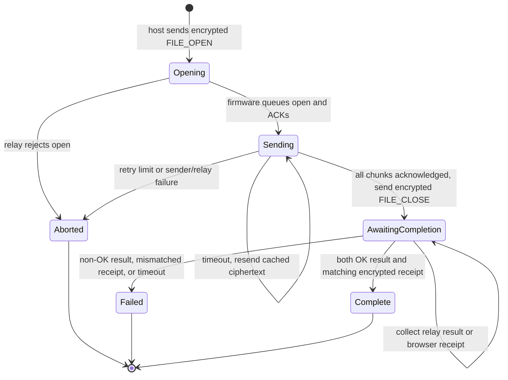

# Protocol reference

This document is the canonical wire-level reference for communication between the browser frontend, Pico firmware, and host agent. It describes the formats implemented by the current source. When this document and code disagree, treat code as authoritative and update this document in the same change.

Related documents:

- [Architecture](ARCHITECTURE.md)
- [Hardware](HARDWARE.md)
- [Contributor guidance](../AGENTS.md)
- [Python scripting reference](SCRIPTING.md)
- [Threat model](THREAT_MODEL.md)

## Scope and conventions

There are two application transports:

1. A text/binary WebSocket between the browser and firmware at port 81 `/ws`.
2. A TLV byte stream between firmware and the host agent over the USB control CDC-ACM interface.

Unless stated otherwise:

- Multi-byte integers are unsigned and little-endian.
- Lengths are byte lengths.
- Text is UTF-8.
- Array indices and chunk indices are zero-based.
- Reserved bits must be sent as zero and ignored by receivers unless a protocol version says otherwise.
- `D -> H` means device firmware to host agent; `H -> D` means host agent to device firmware.
- `B -> D` means browser to device; `D -> B` means device to browser.

Types used in layout tables:

| Notation | Meaning |
| --- | --- |
| `u8` | One unsigned byte |
| `u16`, `u32`, `u64` | Little-endian unsigned integer |
| `bytes[n]` | Exactly `n` uninterpreted bytes |
| `utf8[n]` | Exactly `n` bytes of UTF-8 text, without a terminator |
| `rest` | All remaining bytes in the containing frame |

## Version inventory

| Surface | Current version | Where carried | Compatibility behavior |
| --- | ---: | --- | --- |
| WebSocket command/event protocol | 2 | `HELLO.protocols.websocket`; response/event `version` fields | The frontend reports a compatibility error when the WebSocket version differs. Version 2 supports encrypted chunk batching; the single firmware transfer pump emits batches when PSRAM is available. |
| `HELLO` schema | 1 | Top-level `HELLO.version` | The frontend requires `event_type = "hello"` and `version = 1`. |
| File-transfer protocol | 2 | `FILE_OPEN.protocol_version`; WebSocket transfer event `version` | There is no plaintext downgrade: the host and frontend reject the v1 file path. |
| Filesystem protocol | 1 | First `u16` in list requests and pages | Host agent and frontend reject unsupported versions; firmware refuses to forward mismatched pages. |
| Keyboard bytecode | `KBD1` | Four-byte bytecode magic | Firmware executor rejects other magic values. This is an internal effect format, not a user language. |
| USB TLV envelope | Unversioned | None | Compatibility is maintained by stable tag numbers and versioned payloads for complex subprotocols. |

Version numbers are independent. A file-transfer or filesystem format change does not automatically require a WebSocket version bump if it is fully capability-gated and backward compatible, but a change to command framing, response correlation, binary-kind routing, or required `HELLO` fields does.

## USB control CDC TLV stream

### Serial and framing

The host opens the USB CDC port as 115200, 8 data bits, no parity, and 1 stop bit. Because CDC-ACM runs over USB, the baud rate is primarily an API setting rather than a physical UART clock.

The byte stream is a sequence of frames:

| Offset | Field | Type | Notes |
| ---: | --- | --- | --- |
| 0 | `tag` | `u8` | Message type from the registry below |
| 1 | `payload_len` | `u32` | Number of payload bytes; maximum 2048 |
| 5 | `payload` | `bytes[payload_len]` | May be empty |

USB packet boundaries have no application meaning. Headers and payloads may be split across USB packets, and multiple frames may be present in a read buffer.

There is no envelope checksum. File-transfer v2 uses ChaCha20-Poly1305 authentication; keyboard bytecode retains its own integrity checks.

Both endpoints reject lengths over 2048 and attempt to resynchronize. The host decoder scans forward for a plausible complete frame; the firmware decoder slides its five-byte header window after an oversized length. A producer must never depend on this recovery behavior.

Implementation:

- Firmware encoder/stream decoder and tag routing: `firmware/src/usb/ctrl.rs`
- Host frame type, encoder, decoder, and resynchronization: `apps/host-agent/src/tlv.rs`
- Host serial reader/writer and control-port probing: `apps/host-agent/src/transport.rs`

### Tag registry

| Tag | Name | Direction | Payload | Status |
| ---: | --- | --- | --- | --- |
| 1 | `EXECUTE` | D -> H | UTF-8 shell command | Active; host executes it and emits tag 9 output. |
| 2 | `DEBUG_MSG` | D -> H | UTF-8 diagnostic text | Active for `handshake-ok`, `probe-ok`, and logs. |
| 3 | `WS_CONNECT` | Legacy/reserved | Unspecified | Recognized by host transport, not handled by current firmware. |
| 4 | `WS_DATA` | Legacy/reserved | Unspecified | Recognized by host transport, not handled by current firmware. |
| 5 | `WS_DISCONNECT` | Legacy/reserved | Unspecified | Recognized by host transport, not handled by current firmware. |
| 6 | `WS_DATA_RECV` | Legacy/reserved | Unspecified | Recognized by host transport, not handled by current firmware. |
| 7 | `REQUEST_AGENT_STATUS` | Bidirectional | Empty, or ASCII `handshake` | Active for discovery, handshake, probes, and keepalive. |
| 8 | `AGENT_STATUS` | H -> D | Versioned agent identity described below | Active. |
| 9 | `EXECUTE_RESULT` | H -> D | Raw output chunk, up to 2048 bytes | Host produces it; current firmware logs it as unhandled. |
| 10 | `MIC_PCM_DATA` | Reserved | Unspecified | Recognized by host transport; no current producer/consumer. |
| 11 | `DB_CREDENTIALS_REQUEST` | D -> H | Optional UTF-8 prompt label | Active. |
| 12 | `DB_CREDENTIALS_RESPONSE` | H -> D | Empty for cancel, otherwise `username + NUL + password` | Active. |
| 20 | `FILE_OPEN` | H -> D | v2 public envelope plus encrypted manifest | Active. |
| 21 | `FILE_CHUNK` | H -> D | v2 public envelope plus AEAD ciphertext | Active. |
| 22 | `FILE_ACK` | D -> H | Contiguous progress and window credit | Active. |
| 23 | `FILE_CLOSE` | H -> D | v2 public envelope plus encrypted totals/hash | Active. |
| 24 | `FILE_RESULT` | D -> H | Terminal result | Active. |
| 25 | `FILE_ABORT` | Bidirectional | Terminal abort reason | Active. |
| 26 | `FILE_HEARTBEAT` | H -> D | Currently ignored | Reserved for transfer liveness; no current sender. |
| 27 | `FILE_START_REQUEST` | D -> H | Legacy plaintext path | Disabled; current host rejects it. |
| 28 | `FILE_SET_DEFAULT_PATH` | D -> H | Legacy plaintext path | Disabled; current host rejects it. |
| 29 | `FS_LIST_REQUEST` | D -> H | Versioned filesystem request | Active. |
| 30 | `FS_LIST_PAGE` | H -> D | Versioned filesystem page | Active. |
| 31 | `FS_LIST_CANCEL` | D -> H | `request_id: u64` | Active. |
| 32 | `TRANSFER_SESSION_TO_HOST` | D -> H | Versioned session negotiation or Noise transport envelope | Active for file transfer only. |
| 33 | `TRANSFER_SESSION_TO_BROWSER` | H -> D | Versioned session negotiation or Noise transport envelope | Active for file transfer only. |
| 34 | `HOST_OS` | H -> D | UTF-8 target OS name, at most 24 bytes in firmware | Active; `macos` is normalized to `mac`. |
| 240 | `USB_BENCHMARK_START` | Test host -> D | Benchmark version, random token, and ACK cadence | Diagnostic; starts a bounded synthetic CDC-ingress measurement. |
| 241 | `USB_BENCHMARK_DATA` | Test host -> D | Token, sequence, and synthetic bytes | Diagnostic; maximum normal TLV payload applies. |
| 242 | `USB_BENCHMARK_FINISH` | Test host -> D | Token and final frame count | Diagnostic; terminates the active measurement. |
| 243 | `USB_BENCHMARK_RESULT` | D -> test host | Status, token, counters, device elapsed microseconds, and checksum | Diagnostic; emitted at the configured cadence and on completion/error. |
| 244 | `USB_RAW_BENCHMARK_START` | Test host -> D | Version, random token, and exact raw byte count | Diagnostic; switches the control OUT endpoint into bounded raw-counting mode after the started response. |
| 245 | `USB_RAW_BENCHMARK_RESULT` | D -> test host | Status, token, byte/packet counters, and device elapsed microseconds | Diagnostic; emitted on start, completion, overflow, or timeout. |

Tags are globally allocated. Do not reuse a reserved or legacy value for a different payload. Search all three components and tests before changing this table.

The version-1 USB benchmark uses only deterministic synthetic data and does not access Wi-Fi, HID, mass storage, host files, or browser state. The benchmark result is exactly 35 bytes: `version: u16`, `status: u8`, `token: u32`, `highest_sequence: u32`, `frame_count: u32`, `byte_count: u64`, `elapsed_us: u64`, and wrapping byte-sum `checksum: u32`. Status values are 0 started, 1 progress, 2 complete, and 3 error. It is an engineering diagnostic rather than part of file-transfer negotiation.

The version-1 raw USB benchmark isolates endpoint and host-write overhead from TLV parsing. Its 14-byte start payload is `version: u16`, `token: u32`, and `byte_count: u64`; the count must be 1 through 64 MiB. The test host must wait for the started result before sending exactly that many unframed bytes. Until the count is reached, those bytes are not TLV-decoded. The firmware returns to TLV mode after completion, overflow, or five seconds without an OUT packet. Its 35-byte result is `version: u16`, `status: u8`, `token: u32`, `byte_count: u64`, `elapsed_us: u64`, `packet_count: u32`, `full_packet_count: u32`, and `short_packet_count: u32`. This diagnostic does not checksum or retain the raw stream.

### Agent discovery, handshake, and health payloads

On a normal host-agent connection:

1. The host sends tag 7 with payload `handshake`.
2. The host sends tag 8 with its status payload, followed by tag 34 with its target OS.
3. Firmware replies to the handshake with tag 2 and payload `handshake-ok`.
4. During inactivity, the host sends tag 7 with an empty payload as a keepalive/probe.
5. Firmware replies to an empty tag 7 with tag 2 and payload `probe-ok`.

Firmware may independently send an empty tag 7, for example when a WebSocket session opens. The host responds with tag 8.

The current tag 8 payload is:

```text
"PICOAGENT\0" + version_utf8 + "\0" + hostname_utf8
```

The separate tag 34 payload uses Rust's target OS name, except that `macos` is normalized to `mac` for compatibility with the existing UI value. Keeping tag 8 unchanged preserves compatibility with older firmware. Firmware also accepts the legacy tag 8 form containing only a UTF-8 hostname. It stores at most 32 bytes of version, 96 bytes of hostname, and 24 bytes of host OS. A status, host OS, or status request marks the agent as seen; the capability snapshot reports it absent after 25 seconds without activity. Opening the firmware control CDC clears the previous health state. `STATUS.host_os` reports the OS from a present current-format agent, falling back to the browser-selected USB target and then `unknown` when no detected OS is available.

Host keepalive timing:

- Tick interval: 10 seconds.
- Inactivity timeout: 12 seconds.
- On timeout or channel failure, dispatch ends and the outer daemon reconnects.

Implementation:

- Firmware health state and `HELLO` projection: `firmware/src/capabilities.rs`
- Firmware USB handling: `firmware/src/usb/ctrl.rs`
- Host handshake and keepalive: `apps/host-agent/src/dispatch.rs`
- Host reconnect and port probing: `apps/host-agent/src/main.rs`, `apps/host-agent/src/transport.rs`

### Simple control payloads

`EXECUTE` is a UTF-8 command interpreted by the host's platform shell. Combined stdout/stderr is capped at 8192 bytes and returned in one or more tag 9 frames of at most 2048 bytes, with 20 ms between multiple chunks. Empty output produces one empty tag 9 frame. There is currently no firmware-side consumer for tag 9.

`DB_CREDENTIALS_REQUEST` contains an optional prompt label. The host truncates the displayed label to 80 bytes. Only one prompt may be active; concurrent requests receive an empty response. Tag 12 contains either no bytes for cancel/failure or:

```text
username_utf8 + 0x00 + password_utf8
```

NUL is forbidden in both fields. Firmware does not persist the returned credential and logs only the username and password length.

File-transfer paths are not simple control payloads in v2. They are Noise transport plaintexts carried inside tags 32/33. Legacy tags 27/28 and plaintext transfer RPC commands are rejected. Filesystem browsing remains a separate plaintext protocol and is outside this encryption scope.

## Secure file-transfer protocol v2

### Security boundary and unattended session negotiation

Only file-transfer initiation, the selected transfer path, file name, file bytes, exact byte count, and final SHA-256 are protected. Filesystem listing, shell commands, credentials, general diagnostics, ACK/result flow control, packet lengths, timing, session/transfer identifiers, chunk size, and chunk count are not covered by this version.

The browser and host agent establish an in-memory session using `Noise_NNpsk0_25519_ChaChaPoly_SHA256`. The host generates a 128-bit, single-use hexadecimal bootstrap secret and sends it to the browser in the session-ready envelope through the firmware relay. No terminal or user input is involved. Both sides derive the Noise PSK as:

```text
SHA-256("pico-transfer-unattended-v2" || session_id || decoded_bootstrap_secret)
```

The browser generates the random 256-bit session master after the Noise handshake and sends it to the host inside Noise transport encryption. The Pico relays and can observe the bootstrap secret, but never receives the session master or a file key. Session secrets are not flashed or persisted. A WebSocket disconnect clears the browser state; starting a new negotiation invalidates the host's prior session.

This unattended mode provides encrypted transport but no browser authentication. Any client that can access the Pico Web UI can request a bootstrap secret, establish a session, and request host files. It protects established transfers from passive observers that did not participate in negotiation, but it does not protect against an active firmware/USB relay or another authorized Pico Web UI client.

The project [threat model](THREAT_MODEL.md) considers the source PC and host agent untrusted. That endpoint has the source plaintext and session keys and can generate valid encrypted malicious files with matching hashes. AEAD and SHA-256 verify transport consistency, not source trust or file provenance. The trusted receiving browser's local storage is not exposed to the source PC by this protocol.

The session envelope used inside USB tags 32/33 and WebSocket binary kind 3 is:

| Field | Type | Notes |
| --- | --- | --- |
| `session_protocol_version` | `u16` | Must be 2 |
| `kind` | `u8` | 1 session request, 2 session ready, 3 Noise handshake, 4 Noise transport, 5 error/reserved |
| `session_id` | `bytes[16]` | Session request uses all zeroes; host chooses a random value in session ready |
| `body_len` | `u16` | Exact remaining length |
| `body` | `bytes[body_len]` | Session ready carries exactly 32 lowercase hexadecimal bootstrap bytes; otherwise empty, Noise handshake bytes, or Noise ciphertext |

Authenticated browser-to-host control plaintexts inside Noise transport are:

| Kind | Remaining plaintext |
| ---: | --- |
| 1 | Non-empty UTF-8 start path, maximum 512 bytes |
| 2 | Non-empty UTF-8 default path, maximum 512 bytes |
| 3 | `transfer_id: u64` followed by `sha256: bytes[32]` browser receipt |
| 4 | Empty body; start the host's configured/default path inside the encrypted session |

### Per-file encryption

Each transfer uses a fresh random 32-byte salt and one ChaCha20-Poly1305 key. The key is isolated from other files with HKDF-SHA-256:

```text
salt = file_salt
IKM  = session_master
info = "pico-transfer-v2/file-key" || session_id || transfer_id_le
```

Manifest, chunk, and close records share the per-file key but have domain-separated nonces. The 12-byte nonce is zero-filled, with the record type in byte 0 and the chunk/record index encoded big-endian in bytes 8–11. The associated data is:

```text
transfer_version_le || session_id || transfer_id_le || file_salt ||
chunk_size_le || chunk_count_le || record_type || record_index_le
```

Record types are 1 manifest, 2 chunk, and 3 close. Manifest and close use index zero. A retransmission must reuse the exact cached ciphertext; it must never re-encrypt different or identical plaintext under the same record nonce.

### Limits

| Item | Limit/value |
| --- | ---: |
| TLV payload | 2048 bytes |
| Chunk public header | 30 bytes |
| AEAD tag | 16 bytes |
| Maximum plaintext chunk | 2002 bytes |
| Encrypted file name | 96 UTF-8 bytes |
| Encrypted start/default path | 512 UTF-8 bytes |
| Concurrent firmware relay states | 4 |
| Firmware WebSocket event queue | 16 |
| Encrypted chunks per accepted WebSocket batch | 8 |
| Initial/advertised sender window | 8 chunks |
| Maximum accepted window | 64 chunks |
| ACK timeout / retry limit | 5 seconds / 5 retries |
| Browser-receipt timeout | 300 seconds |

### `FILE_OPEN` — tag 20

| Field | Type |
| --- | --- |
| `transfer_protocol_version` | `u16`, must be 2 |
| `session_id` | `bytes[16]` |
| `transfer_id` | `u64` |
| `file_salt` | `bytes[32]` |
| `chunk_size` | `u16`, 1–2002 |
| `chunk_count` | `u32` |
| `ciphertext_len` | `u16` |
| `ciphertext` | `bytes[ciphertext_len]`, authenticated manifest |

The manifest plaintext is `format_version: u8 = 1`, `total_size: u64`, `file_name_len: u16`, then `file_name: utf8[file_name_len]`.

### `FILE_CHUNK` — tag 21

| Field | Type |
| --- | --- |
| `session_id` | `bytes[16]` |
| `transfer_id` | `u64` |
| `chunk_index` | `u32` |
| `ciphertext_len` | `u16`, 16–2018 |
| `ciphertext` | `bytes[ciphertext_len]` |

The frontend authenticates/decrypts each chunk, enforces strict ordering and the authenticated manifest's exact lengths, updates a rolling SHA-256, and queues the plaintext for IndexedDB staging. Firmware can validate only public structure, session/order, and ciphertext-derived plaintext length; it cannot authenticate or inspect the data.

### `FILE_CLOSE` — tag 23

| Field | Type |
| --- | --- |
| `session_id` | `bytes[16]` |
| `transfer_id` | `u64` |
| `ciphertext_len` | `u16` |
| `ciphertext` | `bytes[ciphertext_len]`, authenticated close |

The close plaintext is `total_size: u64`, `chunk_count: u32`, and `sha256: bytes[32]`. The browser compares all three values with its authenticated manifest and streamed plaintext. Only then does it return the Noise-encrypted receipt. The host reports success only after both the firmware relay result and a matching authenticated browser receipt.

### ACK, result, abort, and backpressure

Tags 22, 24, and 25 use the current layouts below, unchanged from v1. They are unencrypted flow-control/diagnostic messages and are never treated as proof of end-to-end authenticity. The host validates ACK monotonicity, sent-index bounds, and offset consistency. Firmware waits for WebSocket queue capacity before ACKing a new chunk, preserving the existing USB-to-browser backpressure chain. Duplicate chunks are ACKed without a second relay.

The host opens one regular-file handle and reads the file once in at most 2002-byte plaintext buffers. It hashes and encrypts each buffer immediately, zeroizes best-effort plaintext buffers, and retains only bounded ciphertext for retries. It does not pre-read, buffer the whole file, or automatically compress it. Compression is deliberately omitted because many inputs are already compressed, content-dependent sizes can leak information, and streaming encryption meets the memory/privacy goal without a second transformation.

Implementation:

- Shared formats and bounds: `crates/transfer-protocol`
- Noise, HKDF, AEAD, and record codecs: `crates/transfer-crypto`
- Host session/control and streaming sender: `apps/host-agent/src/secure_transfer.rs`, `file_transfer.rs`
- Opaque firmware relay/backpressure: `firmware/src/usb/ctrl/relay.rs`
- Frontend session/decryption/receipt and state: `apps/frontend/src/transfer/secure.rs`, `store.rs`

### `FILE_ACK` — tag 22

| Field | Type |
| --- | --- |
| `transfer_id` | `u64` |
| `highest_contiguous_chunk` | `u32`; `0xFFFFFFFF` means none |
| `next_expected_offset` | `u64` |
| `window_credit` | `u16` |

The host removes all in-flight chunks through `highest_contiguous_chunk`. It clamps credit into 1–64, so a zero-credit out-of-order response effectively reduces the sender to one in-flight chunk rather than pausing it completely.

### `FILE_RESULT` — tag 24

| Field | Type |
| --- | --- |
| `transfer_id` | `u64` |
| `result_code` | `u8` |
| `detail_len` | `u16` |
| `detail` | `utf8[detail_len]` |

Result codes:

| Code | Meaning | Current firmware emission |
| ---: | --- | --- |
| 0 | OK | All declared chunks accepted and encrypted close queued for the browser |
| 1 | Hash mismatch | Defined by host decoder; not currently emitted by firmware |
| 2 | Size/count mismatch | Close session ID or accepted chunk count does not match the relay state |
| 3 | Aborted | Firmware received `FILE_ABORT` |
| 4 | Internal error | Defined by host decoder; not currently emitted by firmware |
| Other | Unknown/future | Preserved by host decoder |

### `FILE_ABORT` — tag 25

| Field | Type |
| --- | --- |
| `transfer_id` | `u64` |
| `reason_code` | `u8` |
| `detail_len` | `u16` |
| `detail` | `utf8[detail_len]` |

Abort reason codes:

| Code | Meaning and current use |
| ---: | --- |
| 1 | Host sender failure, including read/metadata errors and exhausted ACK retries; malformed encrypted envelopes are logged and rejected silently by firmware |
| 2 | Duplicate transfer ID with a mismatched public open envelope |
| 3 | Invalid encrypted chunk session/size/bounds |
| 4 | Unknown transfer ID |
| 5 | Capacity/relay failure, including no browser, a disconnected browser, or full relay state |

Codes 2–5 are emitted by firmware; the host uses code 1 for local sender failures. Treat reason strings as diagnostics and reason numbers as the stable machine-readable field.

### Transfer completion lifecycle


```mermaid
stateDiagram-v2
    [*] --> Opening: host sends encrypted FILE_OPEN
    Opening --> Sending: firmware queues open and ACKs
    Opening --> Aborted: relay rejects open
    Sending --> Sending: encrypted chunk queued, then ACK
    Sending --> Sending: timeout, resend cached ciphertext
    Sending --> Aborted: retry limit or sender/relay failure
    Sending --> AwaitingCompletion: all chunks acknowledged, send encrypted FILE_CLOSE
    AwaitingCompletion --> AwaitingCompletion: collect relay result or browser receipt
    AwaitingCompletion --> Complete: both OK result and matching encrypted receipt
    AwaitingCompletion --> Failed: non-OK result, mismatched receipt, or timeout
    Aborted --> [*]
    Failed --> [*]
    Complete --> [*]
```

The relay result and browser receipt may arrive in either order; the host requires both before success. Firmware cannot inspect the encrypted close totals/hash. Its OK means the declared public chunk count was accepted and close was queued; the browser additionally checks exact manifest/close lengths, streamed size/count, and SHA-256. Receipt verification does not confirm that the user saved the file. See [architecture](ARCHITECTURE.md#file-transfer-path-and-backpressure) for queue ownership and persistence boundaries.

### Disabled legacy transfer formats

V1 plaintext `FILE_OPEN`, `FILE_CHUNK`, and `FILE_CLOSE` are unsupported. Plaintext start/default tags 27/28 and WebSocket binary kind 1 remain reserved and disabled. Current firmware requires v2 envelopes; the frontend rejects plaintext manifests/chunks and the host rejects plaintext start/default requests. There is no downgrade or simulation/drop mode. ACK/result/abort layouts remain active as specified above; historical plaintext formats are available in Git history.

## Filesystem protocol v1 over TLV

Filesystem requests originate in the browser, pass through firmware, and are executed by the host agent. Pages return through firmware as WebSocket binary events.

### `FS_LIST_REQUEST` — tag 29

| Field | Type |
| --- | --- |
| `protocol_version` | `u16`, must be 1 |
| `request_id` | `u64` |
| `cursor` | `u32` |
| `entry_limit` | `u16`; zero means default 64, maximum effective value 128 |
| `flags` | `u8` |
| `path_len` | `u16` |
| `path` | `utf8[path_len]` |

Request flag bits:

| Bit | Name | Meaning |
| ---: | --- | --- |
| 0 | `SHOW_HIDDEN` | Include entries whose names start with `.` |
| 1–7 | Reserved | Send as zero |

An empty path resolves to `$HOME`, falling back to the host agent's current directory. The host canonicalizes the path, requires UTF-8 for returned canonical paths and names, sorts directories before files before other entries, and then sorts names case-insensitively with a case-sensitive tie-breaker.

### `FS_LIST_CANCEL` — tag 31

The payload is exactly one `request_id: u64`; it has no version field. Cancellation is best effort. The host suppresses the result if cancellation is observed before the blocking filesystem operation finishes and is removed from the active registry.

### `FS_LIST_PAGE` — tag 30

| Field | Type |
| --- | --- |
| `protocol_version` | `u16`, must be 1 |
| `request_id` | `u64` |
| `status` | `u8` |
| `flags` | `u8` |
| `next_cursor` | `u32` |
| `directory_len` | `u16` |
| `directory` | `utf8[directory_len]` |
| `error_len` | `u16` |
| `error` | `utf8[error_len]` |
| `entry_count` | `u16` |
| `entries` | Repeated entry records below |

Each entry is:

| Field | Type |
| --- | --- |
| `kind` | `u8` |
| `flags` | `u8` |
| `size` | `u64`; zero for non-files |
| `modified_secs` | `u64`; Unix seconds, or `0xFFFFFFFFFFFFFFFF` when unknown |
| `name_len` | `u16` |
| `name` | `utf8[name_len]` |

Page status codes:

| Code | Meaning |
| ---: | --- |
| 0 | OK |
| 1 | Not found |
| 2 | Permission denied |
| 3 | Not a directory |
| 4 | Invalid/non-UTF-8 path |
| 5 | Internal error |

Page flags:

| Bit | Meaning |
| ---: | --- |
| 0 | More entries are available at `next_cursor` |

Entry kinds:

| Code | Meaning |
| ---: | --- |
| 0 | Regular file |
| 1 | Directory |
| 2 | Symlink to file |
| 3 | Symlink to directory |
| 4 | Other, broken symlink, or unavailable metadata |

Entry flags:

| Bit | Meaning |
| ---: | --- |
| 0 | Hidden name |
| 1 | Metadata was readable |

The entire page must fit the 2048-byte TLV payload. The host stops adding entries before the byte limit even when `entry_limit` allows more and sets the more-pages flag accordingly.

Implementation:

- Firmware request encoding and response routing: `firmware/src/usb/ctrl.rs`, `firmware/src/usb/ctrl/relay/events.rs`
- Host request decoding, filesystem access, sorting, pagination, cancellation, and page encoding: `apps/host-agent/src/filesystem.rs`, `apps/host-agent/src/dispatch.rs`
- Frontend request construction, page decoding, and view state: `apps/frontend/src/api.rs`, `apps/frontend/src/filesystem.rs`, `apps/frontend/src/app.rs`

## Browser–firmware WebSocket protocol

### Transport and limits

- Endpoint: `ws://<device-host>:81/ws`; normally `ws://192.168.4.1:81/ws`.
- The embedded frontend derives `ws:`/`wss:` and hostname from the page URL and selects port 81, falling back to `192.168.4.1:81`. A frontend served on a non-default development port keeps same-origin `/ws` so Trunk can proxy it.
- Maximum inbound firmware WebSocket frame buffer: 4125 bytes (`script-protocol::MAX_MESSAGE_LEN`).
- Maximum queued text event: 1,024 bytes.
- Maximum queued binary event: 2049 bytes.
- Maximum transmitted/accepted encrypted chunk batch: 16,402 bytes including its binary-kind byte.
- Shared firmware event queue depth: 16.
- Browser-to-firmware binary kind 3 carries bounded secure file-session envelopes. Kind 8 carries correlated Python keyboard effects.
- Standard WebSocket ping receives pong.

Firmware tracks one generation-owned active session. Transfer events use one shared queue rather than per-client broadcast queues, so the newest accepted connection replaces the previous owner instead of splitting events between clients.

HTTP remains deliberately small on port 80: `/health` returns `ok`, while application operations use port 81. Two bounded acceptors allow a refreshed page to connect before its previous socket has fully retired, but only the newest connection owns the active logical session. Firmware closes the displaced connection with application close code `4001`; the displaced frontend pauses automatic reconnect until it is explicitly refreshed.

### `HELLO` capability handshake

Firmware sends `HELLO` as the first application text message immediately after WebSocket upgrade. The browser also requests `HELLO` through correlated RPC during its connection refresh. Firmware may send an updated unsolicited `HELLO` when host-agent status changes.

Schema:

```json
{
  "event_type": "hello",
  "version": 1,
  "firmware": {
    "version": "0.1.0",
    "build": "0.1.0-release"
  },
  "protocols": {
    "websocket": 3,
    "transfer": 2,
    "filesystem": 1
  },
  "host_agent": {
    "present": true,
    "version": "0.1.0",
    "hostname": "example-host"
  },
  "keyboard": {
    "layouts": ["win_en-US", "win_en-GB", "win_pt-BR", "win_de-DE", "mac_en-GB", "mac_pt-BR", "mac_de-DE"],
    "features": ["hid_keyboard", "script_effect_v1"]
  },
  "features": [
    "usb_identity",
    "usb_control",
    "file_transfer",
    "filesystem_browser",
    "transfer_download"
  ],
  "privileged_operations": [
    "host_execute",
    "db_credentials",
    "host_filesystem"
  ]
}
```

`host_agent.version` and `hostname` are `null` when unknown. `privileged_operations` is empty while the host agent is absent. `firmware.build` defaults to `<package-version>-<Cargo-profile>` and can be overridden at build time with `PICO_FIRMWARE_BUILD`.

`privileged_operations` describes capabilities the connected host agent can service; it does not by itself create a browser RPC command. Filesystem browsing uses WebSocket RPC. File-transfer initiation uses the encrypted binary session so its path is not exposed as RPC text. Execute and credential requests originate from the on-device daemon page.

The current frontend:

- Requires top-level `event_type = "hello"` and `version = 1`.
- Reports a hard compatibility error for a WebSocket protocol mismatch.
- Exposes separate transfer/filesystem compatibility checks based on both subprotocol version and feature name.
- Defaults missing `features`, `privileged_operations`, keyboard layouts, and keyboard features to empty arrays.

Implementation:

- Firmware schema and host health projection: `firmware/src/capabilities.rs`
- Firmware initial/updated delivery: `firmware/src/http/routes/ws.rs`, `firmware/src/usb/ctrl.rs`
- Frontend schema, compatibility checks, and routing: `apps/frontend/src/api.rs`, `apps/frontend/src/app.rs`
- Build identifier injection: `crates/build-support/src/lib.rs`

### RPC framing and correlation

Browser request text:

```text
RPC <request_id_u64> <command>
```

Firmware response text:

```json
{
  "event_type": "command/response",
  "version": 1,
  "request_id": 42,
  "payload": {}
}
```

`payload` is the JSON value returned by the command. The browser requires response `version = 3`, matching `HELLO.protocols.websocket`; it accepts a string payload for compatibility and otherwise serializes the JSON value back to text before command-specific parsing. A response-version mismatch completes the matching request with a protocol error.

Firmware also accepts unwrapped legacy command text and returns the raw JSON response without an envelope. The current frontend always uses correlated RPC.

Request IDs start at 1 for every browser WebSocket session. The frontend records a monotonically increasing session ID so events and timeouts from an old socket cannot complete requests on a replacement socket. Pending requests are canceled on connection error/close or before replacement. Read operations time out after 5 seconds; mutation/queue operations time out after 10 seconds. Filesystem page delivery has an additional 15-second application timeout after the queueing RPC succeeds.

### Command registry

Parameters after a command use `key=value&key=value`; string values are percent-encoded by the frontend.

| Command | Parameters | Success payload | Notes |
| --- | --- | --- | --- |
| `HELLO` | None | `HELLO` object | Read timeout |
| `STATUS` | None | `{"usb_enabled":bool,"usb_ready":bool,"host_os":string}` | Read timeout |
| `CONFIG_GET` | None | USB manufacturer/product object | Read timeout |
| `CONFIG_SET` | `manufacturer`, `product` | `{"ok":true}` | Printable ASCII; max 32/48 bytes; rejected while USB enabled |
| `USB_REGISTER` | Optional `os=mac|windows` | `{"ok":true}` | Starts/enables composite USB if needed |
| `USB_UNREGISTER` | None | `{"ok":true}` | Detaches USB after 150 ms |
| `TRANSFER_START` | `path` | Error | Disabled plaintext legacy command; use encrypted binary control kind 1 |
| `TRANSFER_DEFAULT_SET` | `path` | Error | Disabled plaintext legacy command; use encrypted binary control kind 2 |
| `TRANSFER_START_DEFAULT` | None | Error | Disabled because a browser-authenticated session is required |
| `FS_LIST` | `request_id`, `cursor`, `limit`, `flags`, `path` | `{"ok":true,"queued":true}` | Result arrives asynchronously as binary kind 2 |
| `FS_LIST_CANCEL` | `request_id` | `{"ok":true,"queued":true}` | Best effort |
| `TRANSFER_MODE_GET` | None | `{"mode":"relay|simulation","ws_clients":n}` | Read-only mode snapshot |
| `TRANSFER_MODE_SET` | `mode=relay|simulation` | Relay succeeds; simulation errors | Authenticated v2 always requires browser relay/receipt |

Command errors are JSON objects with an `error` string, including `busy`, validation errors, persistence errors, and `unknown command`. The frontend maps them to a typed remote error. Malformed response JSON is a protocol error; socket/send failures, request timeouts, and connection cancellation are separate error categories.

### Asynchronous transfer events

Text messages use these `event_type` values, all with `version: 2`. They contain relay progress/diagnostics only; authenticated manifest and file bytes are binary ciphertext:

| Event | Fields beyond `event_type` and `version` |
| --- | --- |
| `transfer/progress` | `transfer_id`, `received_size`, `total_size`, `finished_chunks`, `chunk_count` |
| `transfer/finished` | `transfer_id` |
| `transfer/failed` | `transfer_id`, `reason` |
| `transfer/aborted` | `transfer_id`, `reason_code`, `detail` |

Progress is emitted at open, every 64 accepted chunks, and at the final chunk. Some status/progress events use nonblocking queue insertion and may be omitted under pressure; open, terminal events, and chunk data use the awaited queue path where implemented. The browser updates authenticated byte/chunk counters from every individual or batched chunk.

### Binary messages

The first byte selects the binary kind:

| Kind | Meaning | Remaining bytes |
| ---: | --- | --- |
| 1 | Legacy plaintext transfer chunk | Rejected/not produced by v2 |
| 2 | Filesystem page | Exact `FS_LIST_PAGE` TLV payload |
| 3 | Secure session/control | Exact session envelope used by USB tags 32/33 |
| 4 | Encrypted file open | Exact v2 `FILE_OPEN` payload |
| 5 | Encrypted file chunk | Exact v2 `FILE_CHUNK` payload |
| 6 | Encrypted file close | Exact v2 `FILE_CLOSE` payload |
| 7 | Encrypted file chunk batch | `chunk_count: u8`, then `chunk_count` repetitions of `payload_len: u16` and an exact v2 `FILE_CHUNK` payload |
| 8 | Python keyboard effect command | Versioned correlated envelope below |

#### Python keyboard effect envelope (binary kind 8)

All integers are little-endian. The entire frame is exact; trailing bytes are rejected.

| Offset | Size | Field |
| ---: | ---: | --- |
| 0 | 1 | Binary kind `8` |
| 1 | 1 | Envelope version `1` |
| 2 | 1 | Operation: `1` run, `2` cancel |
| 3 | 8 | Request ID |
| 11 | 8 | Process ID |
| 19 | 8 | Effect ID |
| 27 | 2 | KBD1 length |
| 29 | 0..4096 | Exact KBD1 bytes; cancel requires length zero |

KBD1 validation is complete and two-pass before the first HID report: reserved flags must be zero, CRC32 and canonical varints must be valid, key usages must be in the supported keyboard range, each delay is at most 5 seconds, and total declared delay is at most 5 minutes. `END` must be present at the exact end of the CRC-covered body; trailing bytes are rejected.

Run is acknowledged only by an asynchronous terminal result after validation/execution:

```json
{
  "event_type": "script/effect_result",
  "version": 1,
  "request_id": "0000000000000001",
  "process_id": "0000000000000001",
  "effect_id": "0000000000000001",
  "status": "completed"
}
```

IDs are fixed-width hexadecimal strings so JavaScript never loses integer precision. Status is `completed`, `rejected`, `cancelled`, or `usb_unavailable`. A WebSocket disconnect cancels the browser's wait and injects a catchable Python exception; the frontend never retries an effect with an unknown outcome.

The effect wire format and statuses are unchanged by hardware presets. A Run while
another local or browser job is reserved returns `rejected` without interrupting
that job. Cancel matches the originating WebSocket generation and process/effect
IDs; stale or unrelated cancels are no-ops. Session teardown cancels its own active
job. Device Y may cancel either owner, reporting `cancelled` for a browser effect.
Completion is routed only to the original generation. Cancellation never resumes
or replays input; key-release cleanup precedes admission of the next job.


Button releases are published to a waiting Python process as:

```json
{"event_type":"script/event","version":1,"event":{"kind":"button","button":"A","edge":"released"}}
```

Kinds 4–7 are host-to-browser only. Firmware prepends kinds 4–6 without decrypting or re-encoding the TLV payload. A singleton transfer pump coalesces two to eight queued kind-5 chunks from the same transfer into kind 7 after at most 500 microseconds. Its uniquely owned 16,402-byte buffer lives in PSRAM and moves to the WebSocket sender until the send completes. If PSRAM is unavailable, firmware emits individual kind-5 chunks. The 16-event input queue, one-frame output queue, and one batch slot remain bounded; USB does not acknowledge a chunk until it has entered this backpressure path.

## Compatibility and change rules

1. Do not renumber or reinterpret an existing TLV tag.
2. Add a payload version before making a breaking change to an unversioned complex payload.
3. Receivers must reject unsupported required versions before processing data.
4. Additive JSON fields are preferred. Existing required fields must remain until the WebSocket protocol version changes.
5. New `HELLO.features` values must gate optional operations; absence means unsupported.
6. Keep numeric widths and little-endian encoding stable within a protocol version.
7. Validate declared lengths before allocation/copy and reject trailing bytes when the current decoder requires an exact payload.
8. Preserve unknown result/status values where possible so newer peers fail intelligibly.
9. A transfer-format change must update host sender, firmware relay, frontend decoder/store, tests, and this document together.
10. A filesystem-format change must update browser request/page code, firmware forwarding, host implementation, tests, and this document together.

## Cross-component implementation index

| Concern | Firmware | Frontend | Host agent |
| --- | --- | --- | --- |
| TLV envelope/tag routing | `firmware/src/usb/ctrl.rs` | Not applicable | `apps/host-agent/src/tlv.rs`, `transport.rs`, `dispatch.rs` |
| Agent handshake/health | `firmware/src/capabilities.rs`, `usb/ctrl.rs` | `apps/frontend/src/api.rs`, `app.rs` | `apps/host-agent/src/dispatch.rs`, `main.rs` |
| WebSocket RPC | `firmware/src/http/routes/ws.rs` | `apps/frontend/src/api.rs` | Not applicable |
| Capability `HELLO` | `firmware/src/capabilities.rs`, `http/routes/ws.rs` | `apps/frontend/src/api.rs`, `app.rs` | Supplies status through tag 8 |
| File transfer | `firmware/src/usb/ctrl/relay*.rs`, `http/routes/ws.rs` | `apps/frontend/src/transfer/`, `ui/idb.js` | `apps/host-agent/src/file_transfer.rs`, `dispatch.rs` |
| Filesystem browser | `firmware/src/usb/ctrl.rs`, `usb/ctrl/relay/events.rs` | `apps/frontend/src/filesystem.rs`, `api.rs`, `app.rs` | `apps/host-agent/src/filesystem.rs`, `dispatch.rs` |
| RustPython keyboard effects | `firmware/src/http/routes/ws.rs`, `usb/hid.rs`; `crates/script-protocol`, `firmware-exec`, `keyboard-core` | `apps/python-worker`, `apps/frontend/src/python.rs`, `api.rs` | Not applicable |
| Protocol tests | Inline module tests | Inline tests in `apps/frontend/src/**`, `apps/python-worker`, and shared protocol crates | Inline tests and `tests/e2e_mac.rs` |
## Explicitly armed CDC bootstrap v1

This is an exclusive stream mode on the existing control CDC interface, entered
only by a local CDC installation action. USB enumeration and DTR alone never
deliver installer source. Normal TLV tags, versions, the 2,048-byte maximum,
and transfer backpressure remain unchanged outside bootstrap. Arming requires a
configured serial identity, a packaged Apple Silicon artifact, a clean TLV
boundary, an empty control queue, no active relay/benchmark/HID job, no detected
agent, and a closed control port. Readiness samples DTR at 100 ms intervals.

All requests end with LF; request lines are limited to 64 bytes before LF.
Requests can span USB packets. One request is outstanding at a time; coalesced
speculative requests, unknown versions, wrong indices, malformed numbers, and
requests in the wrong phase terminate the session. No automatic block retry is
defined in v1: re-arm and restart instead.

| Request | Response |
| --- | --- |
| `B1` | One complete `{ ... }` shell compound command, at most 8 KiB |
| `M1 arm64` | `C1 arm64 <size> 16384 <lowercase-sha256>` plus LF |
| `G1 <zero-based-block-index>` | Exactly the next block's raw file bytes; last block may be shorter |
| `V1` after all blocks | `OK1` plus LF; return to normal TLV service |
| `X1` | Cancel; wait for the owner to close the control port |

Responses ending on an exact 64-byte boundary get an explicit ZLP. A ZLP is
not serial EOF. Firmware streams flash-backed extents through packets no larger
than 64 bytes; neither a 16 KiB block nor the executable is buffered in SRAM.
Generated extents are relative to the existing 4 MiB MSC image and validated
against it. There is no firmware FAT parser and no duplicate executable.

The arm deadline is 30 seconds, request/write inactivity limit is 5 seconds,
and firmware session budget is 120 seconds (a pending read is checked every
100 ms). DTR loss, USB disable, Y Stop, or a failed owning HID job cancels the
session. A failed/cancelled stream remains reserved and quiet until DTR drops:
ordinary commands return busy instead of contaminating a waiting shell reader.
TLV decoder state is reset at mode boundaries. Successful `V1` means the host
reported verification; it does not prove an agent handshake.

HELLO v1 adds an optional `cdc_bootstrap` object with `version: 1`, `available`,
`busy`, and `state` (`idle`, `armed`, `downloading`, `verified`, `failed`, or
`cancelled`). Firmware publishes updates through the existing WebSocket owner;
older clients can ignore the additive fields. The frontend displays installation
state and disables new scripts/transfers/filesystem requests while busy. Text
capacity grows from 768 to 1,024 bytes to fit HELLO and its RPC envelope; existing
event queues still use their 2,049-byte payload capacity and unchanged depths.

The host installer uses native macOS shell/file utilities, feature-detects
`dd iflag=fullblock`, otherwise reads byte counts, and checks each accumulated
length and final SHA-256. A private staging directory on the destination
filesystem provides atomic replacement. Existing destination symlinks and
nonregular executable paths are rejected. Its watchdog closes CDC descriptors
before spawning a timer; interruption reaps the reader and timer and removes
staging. Serial descriptors are closed with a standalone `exec` before launch.
HUP is ignored before forking so detached startup is protected immediately.
The first stage has no host watchdog before complete installer delivery; use
Terminal Control-C for that case. SHA-256 provides transfer integrity under the
existing trusted-device distribution model, not independent device authenticity.
